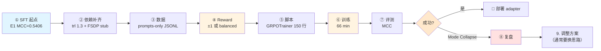
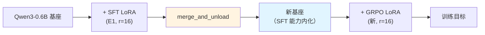
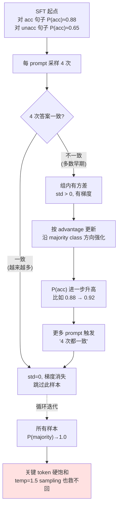
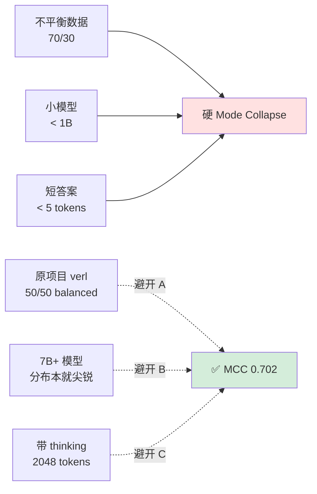
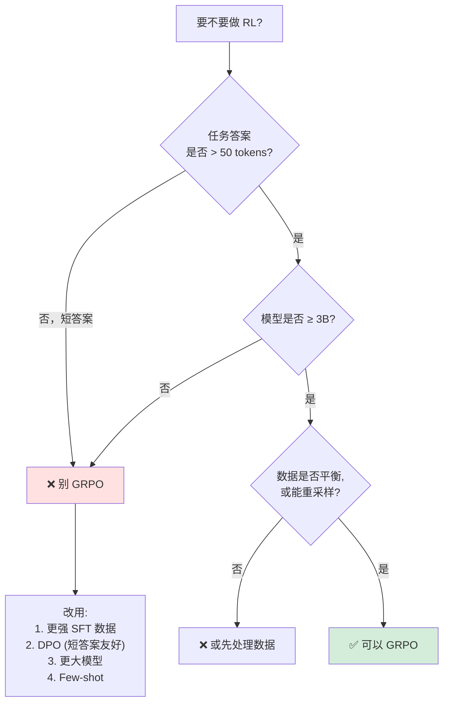

# LoRA GRPO 完整教程：从 SFT 之后到 RL 对齐（Qwen3-0.6B / CoLA 实战）

> 创建日期：2026-05-05
> 实战项目：[zzbased2/CoLA-RL](https://github.com/zzbased2/CoLA-RL) `my_try/` 目录
> 实测硬件：NVIDIA L20 14 GB（bf16）
> 配套代码：`my_try/scripts/train_lora_grpo.py` + `my_try/scripts/eval_lora.py`
> 前置教程：[lora_sft_tutorial.md](./lora_sft_tutorial.md)（强烈建议先读完 SFT 教程）
> 实验记录：[step6_summary.md](./step6_summary.md)
>
> 这是一份**把 RL 从"玄学"拉回"工程"**的教程。正文 5 章讲流程 + 3 章讲失败复盘（mode collapse），
> 看完你将学会：
> - 如何用 trl 1.3 的 `GRPOTrainer` 在 14 GB 卡上跑 GRPO（不用 vLLM）
> - GRPO 的 4 个核心超参（num_generations / max_completion_length / beta / temperature）各自怎么选
> - 为什么**短答案 + 不平衡数据 + 小模型**三个条件同时存在时，GRPO 必崩
> - 如何用 `frac_reward_zero_std` / `entropy` / `KL` 三个训练指标做实时"健康体检"

---

## 目录

- [0. 整体路线图](#0-整体路线图)
- [1. 算法速览：GRPO 到底在做什么](#1-算法速览grpo-到底在做什么)
- [2. 前置依赖：从 SFT 到 GRPO 需要新增什么](#2-前置依赖从-sft-到-grpo-需要新增什么)
- [3. 数据准备：prompts-only 数据集](#3-数据准备prompts-only-数据集)
- [4. 奖励函数设计](#4-奖励函数设计)
- [5. 训练脚本设计](#5-训练脚本设计)
- [6. 训练执行与监控](#6-训练执行与监控)
- [7. 评测与结果](#7-评测与结果)
- [8. Mode Collapse 深度复盘](#8-mode-collapse-深度复盘)
- [9. 注意事项总结](#9-注意事项总结)
- [10. 什么时候用 GRPO / 什么时候不用](#10-什么时候用-grpo--什么时候不用)
- [11. 一页式可复用 SOP](#11-一页式可复用-sop)
- [12. 文件索引与参考](#12-文件索引与参考)

---

## 0. 整体路线图



**全流程时长**：单次实验约 **70 min**（含 66 min 训练 + 4 min 评测与分析）。

**⚠️ 重要前提**：GRPO **不是**"从零训练"，它要求你**已经有一个 SFT checkpoint**作为起点。想象你在雕塑——SFT 是从木头到"可以辨认出形状"的粗加工阶段，GRPO 是用小刻刀做精加工。木头还没成形就用刻刀，只会把它凿碎（[§8 SMOKE 实验](#83-smoke-基座直接-grpo-为什么必崩)）。

---

## 1. 算法速览：GRPO 到底在做什么

> 这一节目的不是证明公式，而是让你**对每一个超参的作用有直觉**。已熟悉 GRPO 的读者可跳到 [§2](#2-前置依赖从-sft-到-grpo-需要新增什么)。

### 1.1 一句话说清 GRPO

> 对每个 prompt 采样 **N 次**不同的回答 → 用 reward 函数打分 → **组内归一化**得到优势 A → 用 PPO loss 更新策略模型。

与 PPO 的**核心区别**：GRPO **不需要 critic 模型**。优势 A 直接用**同一 prompt 下 N 个 rollout 的 reward 做 z-score**：

```
A_i = (r_i − mean(r_1..r_N)) / std(r_1..r_N)
```

→ 好处：省一份 critic 权重（对小显存环境简直是救命）。
→ 坏处：如果 N 次采样答案**完全一致**，`std=0`，优势恒为 0，梯度消失——这就是 GRPO 特有的 **"zero-variance collapse"**。

### 1.2 标准 GRPO loss（trl 1.3 版本）

$$
\mathcal{L}_{\text{GRPO}} = -\mathbb{E}\left[ \min\Big(\tfrac{\pi_\theta(o|q)}{\pi_{\text{old}}(o|q)} A,\ \text{clip}(\cdot, 1\pm\epsilon) A\Big) \right] + \beta \cdot \mathrm{KL}(\pi_\theta \| \pi_{\text{ref}})
$$

- 前半截：PPO 的 clipped surrogate，逼 `π_new` 往高优势方向移动但别漂太远
- 后半截：**KL 约束到 SFT 起点 `π_ref`**，系数 `β` 控制"允许偏离多少"
- 当 `β=0`（Dr.GRPO 风格）：不要 Ref 模型，纯靠 PPO clip 约束——**显存砍一半但控制弱**

### 1.3 4 个关键超参的直觉

| 超参 | 作用 | 在 CoLA 上我们的选择 | 依据 |
| --- | --- | :-: | --- |
| `num_generations` (N) | 每个 prompt 采几次。**N 大优势估计准，小则噪声大** | **4**（原项目 16）| 14 GB 显存限制，每组 4 次对二分类任务够 |
| `max_completion_length` | 生成长度上限 | **8**（原项目 2048）| 答案 `acceptable`/`unacceptable` 最多 3 token |
| `beta` (β) | KL 约束强度 | **0 → 0.05**（v1/v2 vs v3）| 0=最省显存，0.05=强制紧贴 SFT |
| `temperature` | 采样温度 | **1.2**（默认 1.0）| 增加组内多样性，抑制 zero-std |

这 4 个参数互相耦合。比如 N 太小 + temp 太低 → **几乎必定触发 zero-variance collapse**（[§8](#8-mode-collapse-深度复盘)）。

### 1.4 GRPO vs LoRA SFT 的对比视角

| 维度 | LoRA SFT | LoRA GRPO |
| --- | --- | --- |
| 训练信号 | token 级交叉熵（监督）| 序列级 reward（RL） |
| 数据 | (prompt, answer) 对 | **只要 prompt + reward fn** |
| loss 能降到 0 吗 | 能（过拟合）| **永远不到 0**（是奖励信号）|
| 典型 loss 值 | 0.4 → 0.05 | 0.01 ± 0.02（抖动）|
| 主要看什么指标 | `eval_loss` | `reward mean` + `entropy` + `KL` |
| 稳定性 | 高 | **低**（需精细调参） |
| 对 lr 容忍度 | 大（1e-4～5e-4）| **小**（1e-6～5e-6）|

---

## 2. 前置依赖：从 SFT 到 GRPO 需要新增什么

### 2.1 硬件需求

| 项 | 推荐 | 我们实测（Qwen3-0.6B，num_gen=4）|
| --- | :-: | :-: |
| GPU 显存 | 12+ GB | 1.66 GB（β=0）/ ~4 GB（β=0.05 带 Ref）|
| GPU 显存（num_gen=16，对齐原项目）| **22+ GB** | 14G 装不下 |
| 内存 | 32 GB | 185 GB |

**观察**：0.6B + num_gen=4 的 GRPO **只占 1.66 GB** ——GRPO 本身不是显存瓶颈，**扩 num_generations 才是**。

### 2.2 软件依赖（在 SFT 环境之上）

| 包 | SFT 已有 | GRPO 是否需要新增 |
| --- | :-: | :-: |
| `torch 2.5.1` | ✅ | - |
| `transformers 5.7.0` | ✅ | - |
| `peft 0.19.1` | ✅ | - |
| `trl 1.3.0` | ✅ | - |
| `_lzma` stub | ✅ | - |
| **`FSDPModule` stub** | ❌ | ✅ **必须新增** |

### 2.3 ⚠️ 新坑：`FSDPModule` import error

**现象**：SFT 能正常跑，但一 `from trl import GRPOTrainer` 就炸：

```python
>>> from trl import GRPOTrainer
ImportError: cannot import name 'FSDPModule' from 'torch.distributed.fsdp'
```

**原因**：
- trl 1.3 的 `trl/models/utils.py` 里硬 import 了 `FSDPModule`（torch 2.6+ 的 FSDP2 新类）
- 我们 torch 是 2.5.1，只有 FSDP1，没这个类
- `SFTTrainer` 不依赖 → SFT 没感觉；`GRPOTrainer` 依赖 → GRPO 死

**修复**（同 `_lzma` 思路，打 stub 不升 torch）：

```bash
# 文件 1: .venv-cola/lib/python3.12/site-packages/_fsdp_compat.py
cat > .venv-cola/lib/python3.12/site-packages/_fsdp_compat.py <<'EOF'
"""给 torch.distributed.fsdp 注入 FSDPModule stub，兼容 trl 1.3。"""
try:
    import torch.distributed.fsdp as _fsdp
    if not hasattr(_fsdp, "FSDPModule"):
        class FSDPModule:  # trl 里只做 isinstance 检查，永远不会命中
            pass
        _fsdp.FSDPModule = FSDPModule
except Exception:
    pass
EOF

# 文件 2: sitecustomize.py 让它启动时自动 import
cat > .venv-cola/lib/python3.12/site-packages/sitecustomize.py <<'EOF'
try:
    import _fsdp_compat  # noqa: F401
except Exception:
    pass
EOF
```

**验证**：

```bash
.venv-cola/bin/python -c "from trl import GRPOTrainer; print('ok')"
# 应输出: ok
```

### 2.4 SFT 起点检查（必做）

确认你有一个**能用**的 SFT adapter。我们用的是：

```
my_try/ckpt/Qwen3-0.6B-lora-E1-r16/
  ├── adapter_config.json
  ├── adapter_model.safetensors
  ├── chat_template.jinja
  ├── tokenizer.json / tokenizer_config.json
  └── run_info.json
```

**硬指标**：该 adapter 在评测集上 **MCC > 0**（最好 > 0.3）。如果 SFT 的 MCC 接近 0，说明模型还只会输出多数类——此时直接做 GRPO **100% 会 zero-variance collapse**（见 [§8.3 SMOKE 实验](#83-smoke-基座直接-grpo-为什么必崩)）。

---

## 3. 数据准备：prompts-only 数据集

### 3.1 关键转变：不再需要 "answer" 列

**SFT 数据**（有监督）：

```json
{"messages": [
  {"role": "user", "content": "..."},
  {"role": "assistant", "content": "acceptable"}   ← 监督标签
]}
```

**GRPO 数据**（无监督 prompt，reward 函数打分）：

```json
{
  "prompt": "<|im_start|>user\nDecide whether ...\n<|im_end|>\n<|im_start|>assistant\n",
  "ground_truth": "acceptable",      ← 给 reward fn 用，不是监督
  "sentence": "The cat sat on the mat."
}
```

**核心差异**：`prompt` 字段要**已经 render 好 chat template**（含 `<|im_start|>assistant\n`，让模型从这里开始补）。`ground_truth` 只是给 reward 函数比对用，**trl 不会把它当监督**。

### 3.2 转换代码

```python
def load_cola_as_prompts(tsv_path, tokenizer, max_samples=0):
    df = pd.read_csv(tsv_path, sep="\t", header=None,
                     names=["source", "label", "first_label", "text"])
    if max_samples > 0:
        df = df.head(max_samples)

    rows = []
    for row in df.itertuples(index=False):
        user_content = PLAIN_TEMPLATE.format(sentence=row.text)
        messages = [{"role": "user", "content": user_content}]
        prompt_str = tokenizer.apply_chat_template(
            messages,
            tokenize=False,            # ⚠️ 要字符串，不是 token ids
            add_generation_prompt=True,# 附加 <|im_start|>assistant\n
            enable_thinking=False,     # 对齐 SFT/eval
        )
        gt = "acceptable" if int(row.label) == 1 else "unacceptable"
        rows.append({"prompt": prompt_str, "ground_truth": gt, "sentence": row.text})
    return Dataset.from_list(rows)
```

### 3.3 ⚠️ `enable_thinking=False` 的后果

Qwen3 的 chat template 在 `enable_thinking=False` 时会**主动**在 assistant 段开头塞一段：

```
<|im_start|>assistant
<think>

</think>

```

这相当于模型被"告知思考已结束，请直接作答"。对短答案任务是想要的（避免浪费 token），但也意味着 **GRPO 训练的是"裸答案"**，剥夺了模型在 rollout 时的推理空间——这是后来 mode collapse 的根源之一（[§8.5](#85-为什么短答案是致命伤)）。

### 3.4 数据集字段会被 trl 当 kwargs 传给 reward fn

这是一个**极其容易忽略的机制**：

```python
# 你的 dataset:
[{"prompt": "...", "ground_truth": "acceptable", "sentence": "..."}]

# 训练时 trl 会调用:
reward_fn(completions=[...], ground_truth=[...], sentence=[...])
                         #  ↑ 除 prompt 外的字段都会被当 kwargs 传入
```

所以 **reward fn 的签名**要写成 `fn(completions, ground_truth, **kwargs)`，其他字段会自动送到。

---

## 4. 奖励函数设计

### 4.1 最朴素版本：±1 reward（v1）

```python
def reward_fn(completions, ground_truth, **kwargs):
    rewards = []
    for comp, gt in zip(completions, ground_truth):
        pred = parse_answer(comp)
        if pred is None:             # 解析失败
            rewards.append(-1.0)
        elif pred == gt:             # 答对
            rewards.append(+1.0)
        else:                        # 答错
            rewards.append(-1.0)
    return rewards
```

这是原项目 verl `cola.py` 的风格。**简单但在不平衡数据上会崩**：

| CoLA 训练集分布 | "模型永远说 acceptable" 的期望 reward |
| --- | :-: |
| 70.4% acceptable, 29.6% unacceptable | `0.704×1 + 0.296×(-1) = +0.408` |

模型只要学会"一律说 yes"，平均拿 +0.4 分——**看起来是正反馈**，实际上放弃了一半任务。

### 4.2 class-balanced reward（v2）

**思想**：让"答对 unacceptable"的回报 >> "答对 acceptable"，用逆频率加权：

```python
WEIGHT_ACC   = 1.0
WEIGHT_UNACC = 0.704 / 0.296  # ≈ 2.378

def reward_fn(completions, ground_truth, **kwargs):
    rewards = []
    for comp, gt in zip(completions, ground_truth):
        pred = parse_answer(comp)
        if pred is None:
            rewards.append(-1.0)
        elif pred == gt:
            rewards.append(WEIGHT_ACC if gt == "acceptable" else WEIGHT_UNACC)
        else:
            rewards.append(-1.0)
    return rewards
```

**期望 reward 对比**：

| 策略 | 期望 reward | 排序 |
| --- | :-: | :-: |
| "全 yes" | +0.408 | 🟡 |
| "全 no" | **0.000** | 🔴 |
| "完美预测" | **+1.408** | 🟢 |
| 随机二选一 | -0.41 | 🔴 |

"完美"是"全 yes"的 **3.5 倍**——理论上模型有强烈动力学会答 unacceptable。

**⚠️ 但实测 v2 仍然 collapse**（[§8.4](#84-为什么-balanced-reward-也救不回来)）。balanced 改变的是**期望**，但 GRPO 的梯度是**即时**的——起点本就偏向多数类，每次采样 4 次里 3 次是 acceptable，均值方差都偏向它，沿既有方向前进。

### 4.3 parse_answer 的鲁棒性（复用 SFT 教程）

必须能从 `<think>...</think>\nacceptable\n` 这种带思考链的输出里抽出答案：

```python
def parse_answer(text):
    t = text
    if "</think>" in t:
        t = t.split("</think>")[-1]
    t = t.strip().lower()
    # 多行取最后一行
    lines = [ln for ln in t.splitlines() if ln.strip()]
    if lines:
        tail = lines[-1]
        if "unacceptable" in tail:    # ⚠️ 先长后短
            return "unacceptable"
        if "acceptable" in tail:
            return "acceptable"
    return None
```

**依旧的坑**：必须先判 `unacceptable`。详见 SFT 教程 §6.4。

### 4.4 别忘了给"解析失败"一个负奖励

如果模型输出乱码/无关内容，`parse_answer` 返回 `None` —— 必须给负分，否则**模型会学会"输出一堆随机字符"来钻 reward 漏洞**（经典 reward hacking）。

---

## 5. 训练脚本设计

### 5.1 核心代码骨架（约 100 行，去掉注释）

```python
import torch
from datasets import Dataset
from peft import LoraConfig, PeftModel
from transformers import AutoModelForCausalLM, AutoTokenizer
from trl import GRPOConfig, GRPOTrainer

# --- 1. Tokenizer：从 SFT adapter 目录读（而非基座），继承 SFT 时的 chat_template ---
tok = AutoTokenizer.from_pretrained("my_try/ckpt/Qwen3-0.6B-lora-E1-r16")
if tok.pad_token_id is None:
    tok.pad_token = tok.eos_token
tok.padding_side = "left"    # ⚠️ decoder-only 生成必备

# --- 2. 数据集（prompts only） ---
train_ds = load_cola_as_prompts("cola_data/in_domain_train.tsv", tok)

# --- 3. 基座 + 合并 SFT adapter → 作为 GRPO 起点 ---
base = AutoModelForCausalLM.from_pretrained(
    "model/Qwen3-0.6B", dtype=torch.bfloat16, device_map="cuda"
)
base.config.use_cache = False
sft = PeftModel.from_pretrained(base, "my_try/ckpt/Qwen3-0.6B-lora-E1-r16")
model = sft.merge_and_unload()   # ⭐ 关键：把 SFT LoRA merge 进基座，再叠 GRPO LoRA

# --- 4. LoRA config（给 GRPO 再加一层新 LoRA） ---
lora_cfg = LoraConfig(
    r=16, lora_alpha=32, lora_dropout=0.05, bias="none",
    target_modules=["q_proj", "k_proj", "v_proj", "o_proj"],
    task_type="CAUSAL_LM",
)

# --- 5. GRPOConfig ---
grpo_cfg = GRPOConfig(
    output_dir="my_try/ckpt/Qwen3-0.6B-grpo-E1-GRPO-r16",
    num_train_epochs=1,
    per_device_train_batch_size=1,
    gradient_accumulation_steps=4,

    # ⭐ GRPO 专属四大超参
    num_generations=4,              # 每 prompt 采样 4 次
    max_completion_length=8,        # CoLA 答案最多 3 token
    temperature=1.2,                # 比默认 1.0 略高，提采样多样性
    top_p=0.95,
    beta=0.0,                       # Dr.GRPO 风格，无 Ref 模型
    use_vllm=False,                 # 纯 PyTorch rollout

    learning_rate=1e-5,             # ⚠️ 比 SFT 的 2e-4 小 20×
    warmup_ratio=0.05,
    lr_scheduler_type="cosine",
    bf16=True,
    gradient_checkpointing=True,
    gradient_checkpointing_kwargs={"use_reentrant": False},

    logging_steps=5,
    save_strategy="epoch",
    save_total_limit=1,
    report_to=[],
    log_completions=True,           # ⭐ 把每步的采样结果 dump 出来，排查 collapse 必备
    num_completions_to_print=2,
    remove_unused_columns=False,    # ⭐ 保留 ground_truth 字段
)

# --- 6. Trainer ---
trainer = GRPOTrainer(
    model=model,
    reward_funcs=reward_fn,         # ⭐ 传 Python 函数，trl 会自动调
    args=grpo_cfg,
    train_dataset=train_ds,
    processing_class=tok,           # ⚠️ trl 1.x 是 processing_class，不是 tokenizer
    peft_config=lora_cfg,
)

trainer.train()
trainer.save_model()
```

完整脚本见 [`my_try/scripts/train_lora_grpo.py`](../scripts/train_lora_grpo.py)（368 行，含参数解析和 run_info 落盘）。

### 5.2 关键超参逐个解读

#### `num_generations = 4`

| N | 优势估计质量 | 显存 | 训练耗时 |
| :-: | :-: | :-: | :-: |
| 2 | ❌ 方差巨大，基本没用 | ↓↓ | ↓↓ |
| **4** | 🟡 噪声较大，可用 | ↓ | ↓ |
| 8（trl 默认）| 🟢 标准 | - | - |
| 16（原项目）| 🟢🟢 稳定 | ↑ | ↑ |

我们用 4 是妥协：14 GB 卡 + `max_completion=32` 时 8 也能跑，但加大 batch 后 8 容易 OOM，保险起见选 4。

#### `max_completion_length = 8`

一个会让很多人栽跟头的参数。错误做法：

- ❌ `= 512`（通用默认）：CoLA 答案 2 token，剩下 510 步在填垃圾，浪费**100×**时间
- ❌ `= 2048`（原项目 verl）：原项目用 thinking mode 生成长 CoT，我们不开 thinking 就是白烧
- ✅ `= 8`（我们）：答案 `unacceptable` 占 3 token + EOS + 2 token 余量

**数字换算**：`max_completion=2048` 比 `=8` 慢 **80 倍**（8551 样本 × 4 gen × 每 token 开销）。

#### `temperature = 1.2, top_p = 0.95`

**比默认（1.0, 1.0）略激进**。原因：
- 二分类答案空间极小（几乎只有 "acceptable" / "unacceptable"）
- 温度不够高 → 4 次采样大概率全一致 → 触发 `std=0` → 梯度为 0

1.2 是经验甜点——大到能探索，小到不会乱码。

#### `beta = 0.0`（v1/v2）vs `beta = 0.05`（v3）

```python
# beta=0：Dr.GRPO 风格，loss = -clipped_surrogate * advantage
#         ✅ 省显存（不加载 Ref 模型）
#         ❌ 没有"回拉"，容易跑偏

# beta=0.05：标准 GRPO，loss = -... + 0.05 * KL(π || π_ref)
#         ✅ 强制紧贴 SFT 起点
#         ❌ Ref 模型要多占 1.2 GB（0.6B bf16）
```

**我们三次实验对比**：

| 实验 | beta | 训练显存 | 末期 entropy | 评测 MCC |
| :-: | :-: | :-: | :-: | :-: |
| v1 | 0 | 1.66 GB | 0.001（硬崩） | 0.0000 |
| v2 | 0 | 1.66 GB | 0.015（硬崩） | 0.0000 |
| v3 | **0.05** | ~4 GB | **0.20**（看起来正常）| **0.0000** |

v3 KL 真的生效了（训练层面的 entropy 比 v1/v2 高 15 倍），**但评测仍全崩**——这是 GRPO 特有的"训练健康假象"，[§8.6](#86-训练健康-评测健康) 详解。

#### `learning_rate = 1e-5`

**比 LoRA SFT 的 2e-4 小 20 倍**。RL 的梯度信号比监督信号噪声大得多，lr 必须更保守。

| 训练方式 | 典型 lr |
| --- | :-: |
| 全参 SFT | 1e-5 ~ 5e-5 |
| LoRA SFT | **1e-4 ~ 5e-4** |
| LoRA GRPO | **5e-6 ~ 2e-5** |
| 全参 GRPO | 1e-6 ~ 5e-6 |

### 5.3 为什么要先 `merge_and_unload`

这是**第 5.1 节代码里最容易被忽略但至关重要的一行**：

```python
sft_model = PeftModel.from_pretrained(base_model, args.sft_adapter)
model = sft_model.merge_and_unload()   # ← 把 SFT LoRA 合并回基座
```

不合并会怎样？PEFT 不允许**在同一个模型上挂两层 LoRA**（会报错或行为未定义）。所以要**把 SFT LoRA 烧进基座**，让"融合后的基座"成为新起点，然后 GRPO 在其上再训练一层全新的 LoRA。



### 5.4 trl 1.3 的几个"坑参数"

| 参数名 | 我们写法 | 备注 |
| --- | --- | --- |
| `processing_class=` | `tok` | ⚠️ 不是 `tokenizer=`（1.x 已改） |
| `remove_unused_columns=False` | 必须 | 否则 `ground_truth` 会被 Dataset 自动丢掉，reward fn 拿不到 |
| `log_completions=True` + `num_completions_to_print=2` | 强烈建议 | 每 logging_steps 打印 2 条真实采样，是排查 collapse 的**唯一有效工具** |
| `use_vllm=False` | 14 GB 卡必选 | vLLM 会独占 50%+ 显存 |
| `save_total_limit=1` | 推荐 | GRPO 一个 checkpoint 35 MB，但也够占磁盘 |

---

## 6. 训练执行与监控

### 6.1 后台启动

```bash
cd /data/workspace/Github-open/CoLA-RL

# v1: ±1 reward, no KL（最经典配置）
PYTHONUNBUFFERED=1 nohup .venv-cola/bin/python my_try/scripts/train_lora_grpo.py \
    --base_model model/Qwen3-0.6B \
    --sft_adapter my_try/ckpt/Qwen3-0.6B-lora-E1-r16 \
    --exp E1-GRPO \
    --epochs 1 --bsz 1 --grad_accum 4 \
    --num_generations 4 --max_completion_length 8 \
    --lr 1e-5 --temperature 1.2 --top_p 0.95 \
    --beta 0.0 \
    > /tmp/grpo_v1.log 2>&1 &
echo "V1_PID=$!"
```

### 6.2 实时健康体检：4 个关键指标

trl 会每 `logging_steps` 打一行指标。**别只看 reward**——至少盯 4 个：

| 指标 | 健康范围 | 危险信号 | 含义 |
| --- | :-: | :-: | --- |
| **`reward`** (mean) | 缓慢上升 | 突然爆涨 | 平均奖励 |
| **`reward_std`** | **> 0.1** | → 0 | 组内方差；=0 则梯度消失 |
| **`frac_reward_zero_std`** | **< 0.5** | → 1.0 | 有多少 prompt 组 std=0 |
| **`entropy`** | > 0.1 | → 0.01 | 策略分布熵；崩了说明分布 one-hot |
| `loss` | 小幅震荡 | 恒为 0 | loss 恒 0 = 训不动 |
| `kl`（仅 beta>0） | 单调缓升 | 突然跳涨 | 距离 SFT 起点多远 |

**一行命令体检**：

```bash
grep -E "'reward':|'entropy':|'frac_reward_zero_std':" /tmp/grpo_v1.log | tail -5
```

### 6.3 我们 v1 训练曲线（经典 collapse 轨迹）

| step | reward | reward_std | frac_zero_std | entropy | 诊断 |
| :-: | :-: | :-: | :-: | :-: | --- |
| 20 | 0.50 | 0.59 | 0.45 | 0.230 | 🟢 健康起步 |
| 1000 | 0.72 | 0.30 | 0.70 | 0.095 | 🟡 entropy 在掉 |
| 4340 | 0.80 | 0.10 | 0.90 | 0.035 | 🔴 几乎没多样性 |
| 4620 | 0.525 | 0.05 | 0.95 | 0.023 | 🔴 优势信号消失 |
| **8550** | **~0.5** | **~0** | **~1.0** | **0.001** | ☠️ **硬 collapse** |

**规律**：`entropy < 0.05` 就是拐点——之后几乎不可救。

### 6.4 早停法则（值得实装）

遇到以下任一情况建议早停：

```python
# 伪代码
if step > 500 and entropy < 0.03:
    raise EarlyStop("entropy collapsed, mode collapse inevitable")
if step > 500 and frac_reward_zero_std > 0.95:
    raise EarlyStop("zero-variance, gradient dead")
```

trl 没内置这个，要自己写 callback。我们当时没做，结果白跑 66 min。**血的教训**。

### 6.5 实测耗时与显存

| 配置 | 训练时长 | 显存峰值 |
| --- | :-: | :-: |
| v1 (beta=0, 8551 样本 1 epoch) | **66.0 min** | 1.66 GB |
| v2 (balanced, beta=0, 8551) | 65.6 min | 1.66 GB |
| v3 (beta=0.05, 4275 半量) | 36.6 min | ~4 GB |

对比 SFT：
- SFT 13 min 跑完 3 epoch × 8551
- GRPO 66 min 跑完 1 epoch × 8551（每个 prompt 要 4 次生成）
- → **GRPO 约为 SFT 的 15 倍慢**

---

## 7. 评测与结果

### 7.1 加载 GRPO adapter（和 SFT 一样）

```python
from peft import PeftModel

base = "model/Qwen3-0.6B"
grpo_adapter = "my_try/ckpt/Qwen3-0.6B-grpo-E1-GRPO-r16"

tok = AutoTokenizer.from_pretrained(grpo_adapter)
tok.padding_side = "left"

base_model = AutoModelForCausalLM.from_pretrained(base, dtype=torch.bfloat16, device_map="cuda")
model = PeftModel.from_pretrained(base_model, grpo_adapter)
model = model.merge_and_unload()
model.eval()
```

**注意**：这里加载的 **GRPO adapter 已经隐含了 SFT 的能力**——因为训练时我们 `merge_and_unload` 把 SFT 烧进了基座，GRPO 又在新基座上训练。

### 7.2 三次实验的"三连灾难"

| 实验 | MCC | Accuracy | 混淆矩阵 `[真实, 预测]` | 诊断 |
| :-: | :-: | :-: | :-: | --- |
| **E1 SFT 起点** | **0.5406** | 0.808 | `[[105, 57], [44, 321]]` | ✅ 正常分类器 |
| v1 (±1 reward) | 0.0000 | 0.6926 | `[[0, 162], [0, 365]]` | ☠️ 全 acc |
| v2 (balanced reward) | 0.0000 | 0.6926 | `[[0, 162], [0, 365]]` | ☠️ 全 acc |
| v3 (balanced + KL=0.05) | 0.0000 | 0.6926 | `[[0, 162], [0, 365]]` | ☠️ 全 acc |

**三个混淆矩阵完全相同** —— 三个不同配置的实验都退化到同一个平庸解："永远输出 acceptable"。

### 7.3 Sampling 评测也救不回来

我们一度怀疑 v3（训练末期 entropy=0.20 看起来健康）是**软 collapse**——只是 greedy 解码把概率微偏放大成 one-hot，用 sampling 应该能救回。

于是补做了 sampling 评测（N=5 次采样 + majority vote）：

| 方案 | v3 MCC | pred_acc_rate（采样中 acc 占比）|
| --- | :-: | :-: |
| Greedy | 0.0000 | 1.0000 |
| Sampling T=1.0 | 0.0000 | **1.0000** |
| Sampling T=1.5 | 0.0000 | **1.0000** |

**铁证**：v3 采样 2635 次，**每一次都是 acceptable**——根本不是概率微偏，是**关键 token 的概率已经被训到 ~(0.999, 0.001)**，硬 collapse。详细机制见 [§8.6](#86-训练健康-评测健康)。

### 7.4 为什么失败也是"成功"

虽然 3 次实验 MCC 都是 0，我们仍然拿到了**非零的工程收获**：

1. ✅ 跑通了 trl 1.3 `GRPOTrainer` 的完整 pipeline（含 `FSDPModule` stub）
2. ✅ 1.66 GB 的显存占用证明"小显存也能跑 GRPO"
3. ✅ 收集到了**三份真实的 collapse 训练曲线**（v1/v2/v3），可作教学案例
4. ✅ 证伪了"balanced reward 能救 collapse"的直觉
5. ✅ 证伪了"训练 entropy 健康就够"的直觉

---

## 8. Mode Collapse 深度复盘

> 这一节独立于流程，是 **"为什么 GRPO 在我们的场景上必崩"** 的根本原因分析。
> 如果你只想复现，跳到 [§11 SOP](#11-一页式可复用-sop)。但**建议读**——避免你下次在类似场景浪费一周时间。

### 8.1 三种 Collapse 的类型学

| 类型 | 表现 | 训练指标 | 评测指标 |
| --- | --- | --- | --- |
| **硬 collapse** | 关键 token 概率 → 1.0 | entropy → 0.01 | sampling 也全一致 |
| **软 collapse** | 关键 token 概率微偏（0.55 vs 0.45）| entropy > 0.1 | greedy 放大成 one-hot，sampling 能救 |
| **Zero-variance 停滞** | 组内 4 次采样完全相同 | reward_std → 0 | 模型不更新，卡在起点 |

我们 v1/v2 是**硬 collapse**（entropy=0.01），v3 是**训练指标健康但评测硬 collapse**（entropy=0.20）。**没有一例**是软 collapse。

### 8.2 经典的 Collapse 动力学



### 8.3 SMOKE 实验：基座直接 GRPO（为什么必崩）

我们在写正式实验前做过一次 smoke：**不加载 SFT adapter**，直接从 Qwen3-0.6B 基座开始 GRPO。

结果**训练第一步就卡死**：

| 指标 | 值 | 解读 |
| --- | :-: | --- |
| `loss` | 0 | 没信号 |
| `grad_norm` | 0 | 没梯度 |
| `frac_reward_zero_std` | **1.0** | 100% 组 std=0 |
| `reward_std` | 0 | 全部 4 次采样 reward 相同 |

**原因**：Qwen3-0.6B 基座 **zero-shot MCC=0.000**，对所有句子都输出 acceptable。一个 prompt 采 4 次 → 4 次都是 "acceptable" → reward 全是 +1 → std=0 → 优势=0 → 梯度=0 → 不更新 → 永远跑不动。

**结论**：GRPO 需要 **SFT 先创造多样性**。如果 SFT 后 MCC 还接近 0，GRPO 就别做了——你的起点连"会一些不会一些"都达不到。

### 8.4 为什么 balanced reward 也救不回来

直觉：v2 改了 reward，让"答对 unacc"的分数是"答对 acc"的 2.4 倍，模型应该学会答 unacc 啊？

**实际不然**。GRPO 梯度是**即时**的，沿当前组内采样结果做 z-score。问题在于：

1. SFT 起点模型已经偏向多数类（acc）
2. 从 acc 类样本采 4 次 → 4 次都说 acc → reward 全是 +1.0 → std=0 → 这个组没梯度
3. 从 unacc 类样本采 4 次 → 大概率 3 次说 acc (错) + 1 次说 unacc (对)
   - reward = [-1, -1, -1, +2.378]
   - mean = -0.155, std = 1.48
   - 那个"答对"的样本 advantage = (2.378 − (−0.155)) / 1.48 = **+1.71** （正向，应该被强化）
4. **但**：每个 minibatch 只有 1-2 个 unacc prompt（训练集 70% 是 acc）
5. 绝大多数梯度信号来自**acc 类 prompt** → 这些 prompt 组内梯度为 0，等于没贡献
6. **少数 unacc prompt 的正向信号**被 PPO clip + lr=1e-5 压到几乎不起作用
7. 模型继续沿既有（"全 acc"）方向漂

→ **balanced reward 改变了期望，但改变不了起点的拉力**。

**真正能救的是**（后续可试）：
- 重采样，让每个 minibatch 里 acc:unacc = 1:1（数据层面）
- 或改用 DPO，它是偏好对学习，不受 z-score 的困扰

### 8.5 为什么短答案是致命伤

对比原项目（verl, Qwen3-1.7B, MCC=0.702）和我们：

| 维度 | 原项目 | 我们 |
| --- | --- | --- |
| `max_completion_length` | **2048**（带 thinking） | 8（裸答案） |
| 每 rollout token 数 | 200–800 | 2–3 |
| 单 token 错误是否致命 | ❌ 推理链冗长，单 token 容错 | ✅ **1 个 token 定全局** |

**关键洞察**：GRPO 设计时假设 rollout 是"一条完整的推理链"，信号分摊在几百个 token 上。我们用 2 个 token 的裸答案，等于把 GRPO 塞进一个它**完全不擅长**的场景。

**类比**：GRPO 像梯度下降求函数最小值。长答案 = 高维光滑空间，梯度有方向；短答案 = 一维阶跃函数，只有两个点（acceptable / unacceptable），"梯度"基本是阶跃——这不是 GRPO 能处理的优化问题。

**根本修复方案**：用 R1/V3 蒸馏带 CoT 的数据，重做 SFT，然后 GRPO 在带 thinking 的起点上训。预计时间 ~1 天 + $80 API 费，MCC 有希望推到 0.6+。

### 8.6 训练健康 ≠ 评测健康

**最反直觉的坑**。v3 末期指标看起来完美：

```
entropy=0.20（健康）
kl=0.06（紧贴 SFT）
reward=0.74（稳定在高位）
frac_reward_zero_std=0.75（有 25% 的组还有方差）
```

但评测时 MCC=0.0000，2635 次 sampling 全是 acceptable。为什么？

**真相**：trl 报告的 **`entropy` 是整个生成序列的平均 token entropy**，包含：
- `<|im_end|>` 后的 padding / 随机 token
- `acceptable` 里的 "able" "accept" 这些语素（这些其实概率很集中）
- **关键决策 token**（生成的第 1 个实义 token）

**序列 entropy 0.20 的构成**可能是：
- 关键 token entropy ≈ **0.001**（硬饱和）
- 填充/标点 entropy ≈ 0.4（本来就随机）
- 平均 ≈ 0.20

**所以序列 entropy 是"健康的平均"，掩盖了"关键位置的死亡"**。

**正确诊断方式**：

```python
# 用训练时 dump 的 completions parquet
import pandas as pd
df = pd.read_parquet("my_try/ckpt/.../completions/completions_04000.parquet")
print(df.head())
# 看 completion 列里 acceptable/unacceptable 的比例
```

如果末期几乎全是 acceptable，即使 trl entropy 很高，**也是硬 collapse**。

### 8.7 三要素同时出现才会崩



**我们的场景**：CoLA 70/30 (A ✅) + Qwen3-0.6B (B ✅) + 裸 acc/unacc (C ✅) = **三雷齐响**。

---

## 9. 注意事项总结

### 9.1 按严重程度的坑排行

| 严重 | 坑 | 修复 |
| :-: | --- | --- |
| 🔴 致命 | 基座 MCC≈0 直接 GRPO | 先 SFT，至少 MCC>0.3 再上 GRPO |
| 🔴 致命 | `FSDPModule` import error | 打 stub（[§2.3](#23-️-新坑fsdpmodule-import-error)） |
| 🔴 致命 | PEFT 两层 LoRA 冲突 | 先 `merge_and_unload` 再加新 LoRA |
| 🔴 致命 | `remove_unused_columns=True`（默认）| 改 False，否则 reward fn 拿不到 ground_truth |
| 🟡 严重 | `max_completion_length` 设 512/2048 | 按实际答案长度设（CoLA 设 8） |
| 🟡 严重 | `num_generations=1~2` | ≥4，否则 std 经常为 0 |
| 🟡 严重 | `temperature=1.0` | 用 1.1~1.3 增加多样性 |
| 🟡 严重 | lr 用 SFT 的 2e-4 | GRPO 用 5e-6 ~ 2e-5 |
| 🟢 一般 | 没开 `log_completions` | 必开，否则 collapse 只能事后发现 |
| 🟢 一般 | 没早停 | 写个 callback，entropy<0.03 立停 |

### 9.2 带回家的"方法论七条"

1. **GRPO 必须站在 SFT 肩膀上**：SFT MCC<0.3 别上 GRPO
2. **`num_generations` 越大越稳**：能给到 16 就别 4
3. **`entropy`、`reward_std`、`frac_reward_zero_std` 比 reward 更值得盯**
4. **序列 entropy 会骗人**，要看 completions 的类别分布
5. **不平衡数据先想重采样，再想 balanced reward**
6. **短答案任务慎用 GRPO**，优先考虑 DPO / SFT + 数据扩充
7. **失败也是成果**，把坑记录成这种文档，下次省 1 周

### 9.3 故障诊断清单（扩展自 SFT 教程）

| 现象 | 可能原因 | 处理 |
| --- | --- | --- |
| loss 恒为 0 | 所有组 std=0 | 加 num_generations；加 temperature；检查 SFT 起点 MCC |
| reward 很高但评测 MCC=0 | mode collapse | 看 completions 类别分布；换 DPO 或增量数据 |
| entropy 急跌到 0.01 | 硬 collapse 进行中 | 立刻早停；下次加 beta 和 temperature |
| entropy 正常但 MCC=0 | **软/硬 collapse 的错觉** | 看关键 token 的概率，不看序列平均 |
| import FSDPModule 失败 | torch<2.6 + trl>=1.3 | 打 stub（§2.3） |
| reward fn 收到的 ground_truth 是空 | `remove_unused_columns` 默认 True | 设 False |

---

## 10. 什么时候用 GRPO / 什么时候不用

### 10.1 GRPO 适合的场景

✅ 长答案任务（**≥100 token 的 rollout**）
  - 数学题（step-by-step）
  - 代码生成
  - 长文总结
  - 多步工具调用

✅ 模型规模足够大（**7B+ 为佳**）
  - 小模型概率分布太软，易被 RL 推成 one-hot

✅ 有明确可计算的 reward（**规则 reward 或 verifier 模型**）
  - 数学：答案匹配
  - 代码：单元测试通过率
  - 指令遵循：格式约束

✅ 数据相对平衡，或类别平衡已通过采样修复

### 10.2 GRPO 不适合的场景（我们踩中）

❌ 短答案（< 5 tokens）分类任务
  - **CoLA、情感分类、意图识别** → 用 SFT 或 DPO

❌ 小模型（< 1B）+ 不平衡数据
  - 概率分布软，一个方向强化就彻底偏移

❌ reward 与评测指标不一致
  - 如训练 reward 是 `ans==gt`，但评测 MCC 对召回率敏感 → 很可能被多数类欺骗

❌ 只为"再提一点 MCC"
  - GRPO 的工程成本 ≈ 10 × SFT，收益却没保证

### 10.3 推荐决策树



---

## 11. 一页式可复用 SOP

```bash
# === 0. 前置 ===
cd /data/workspace/Github-open/CoLA-RL
source .venv-cola/bin/activate

# 检查 FSDPModule stub 是否就位（首次必做）
.venv-cola/bin/python -c "from trl import GRPOTrainer; print('ok')"

# === 1. 确认 SFT 起点可用 ===
cat my_try/ckpt/Qwen3-0.6B-lora-E1-r16/run_info.json | jq '.mode'
# 必须是 "lora_sft"，且评测 MCC > 0.3

# === 2. 训练：三个推荐配置 ===

# v1: 标准 GRPO（最省显存）
nohup .venv-cola/bin/python my_try/scripts/train_lora_grpo.py \
    --base_model model/Qwen3-0.6B \
    --sft_adapter my_try/ckpt/Qwen3-0.6B-lora-E1-r16 \
    --exp E1-GRPO --epochs 1 \
    --bsz 1 --grad_accum 4 \
    --num_generations 4 --max_completion_length 8 \
    --lr 1e-5 --temperature 1.2 --top_p 0.95 \
    --beta 0.0 \
    > /tmp/grpo_v1.log 2>&1 &

# v2: 加 balanced reward（应对类别不平衡）
nohup .venv-cola/bin/python my_try/scripts/train_lora_grpo.py \
    [... 同上 ...] \
    --exp E1-GRPO-v2 --reward_balanced \
    > /tmp/grpo_v2.log 2>&1 &

# v3: 加 KL 约束（最稳但也未必能救）
nohup .venv-cola/bin/python my_try/scripts/train_lora_grpo.py \
    [... 同上 ...] \
    --exp E1-GRPO-v3 --reward_balanced \
    --beta 0.05 \
    --max_train_samples 4275 \
    > /tmp/grpo_v3.log 2>&1 &

# === 3. 监控（每 5 min 一次）===
grep -E "'reward':|'entropy':|'frac_reward_zero_std':" /tmp/grpo_v1.log | tail -5

# ⚠️ 健康门槛：
#   entropy > 0.03   （否则立刻早停）
#   frac_reward_zero_std < 0.95

# === 4. 评测 ===
.venv-cola/bin/python my_try/scripts/eval_lora.py \
    --adapter my_try/ckpt/Qwen3-0.6B-grpo-E1-GRPO-r16

# === 5. 看结果 ===
cat my_try/res_lora_Qwen3-0.6B-grpo-E1-GRPO-r16.json | \
    jq '.results[0] | {mcc, accuracy, parse_fail, confusion_matrix}'

# ⚠️ 如果 mcc=0 且混淆矩阵是 [[0, X], [0, Y]] → mode collapse，见 §8
```

---

## 12. 文件索引与参考

### 12.1 本项目核心文件

| 文件 | 作用 |
| --- | --- |
| [`my_try/scripts/train_lora_grpo.py`](../scripts/train_lora_grpo.py) | **GRPO 训练主脚本**（~370 行） |
| [`my_try/scripts/eval_lora.py`](../scripts/eval_lora.py) | 评测（SFT/GRPO 通用） |
| [`my_try/docs/step6_summary.md`](./step6_summary.md) | 三次实验详细记录（v1/v2/v3） |
| [`my_try/docs/lora_sft_tutorial.md`](./lora_sft_tutorial.md) | 前置 SFT 教程 |
| [`my_try/docs/environment.md`](./environment.md) | 环境搭建与踩坑 |
| `my_try/ckpt/Qwen3-0.6B-grpo-E1-GRPO-r16/completions/*.parquet` | 训练时每 20 step dump 的真实采样 |
| `my_try/ckpt/Qwen3-0.6B-grpo-E1-GRPO-r16/run_info.json` | 复现用的参数快照 |

### 12.2 关键参考资料

- **原项目**：[ytzfhqs/CoLA-RL](https://github.com/ytzfhqs/CoLA-RL)（verl 框架，1.7B GRPO 达到 MCC=0.702）
- **trl 文档 - GRPOTrainer**：https://huggingface.co/docs/trl/grpo_trainer
- **GRPO 原论文（DeepSeekMath）**：[Shao et al., 2024](https://arxiv.org/abs/2402.03300)
- **Dr.GRPO**（β=0 的做法）：[Dr.GRPO blog](https://github.com/sail-sg/understand-r1-zero)
- **Mode Collapse 综述**：[Casper et al., 2023 "Open Problems in RLHF"](https://arxiv.org/abs/2307.15217)

### 12.3 失败案例价值清单

| 问题 | 答案（一句话）|
| --- | --- |
| GRPO 能从 MCC 0 的模型起步吗？ | ❌ 基座 MCC≈0 时 zero-variance 卡死（§8.3）|
| balanced reward 能自动解决不平衡问题吗？ | ❌ 改期望但改不了起点拉力（§8.4）|
| 训练 entropy 健康 = 评测也健康吗？ | ❌ 序列 entropy 会掩盖关键 token 的硬饱和（§8.6）|
| sampling 评测能救 greedy 下的 MCC=0 吗？ | 软 collapse 能救，硬 collapse 救不了（§7.3）|
| 短答案能用 GRPO 吗？ | ⚠️ 能跑但易崩，推荐改 DPO 或 SFT（§10.2）|

---

## 13. 附：和 SFT tutorial 的对照表

便于熟悉 SFT 的读者快速上手：

| 章节 | SFT tutorial | GRPO tutorial | 关键差异 |
| --- | --- | --- | --- |
| 算法 | 交叉熵监督 | **奖励 + z-score advantage + PPO clip** | 无标签，靠 reward fn |
| 数据 | (prompt, answer) 对 | **prompt + ground_truth**（后者只给 reward 用） | 不是监督 |
| 起点 | 基座模型 | **必须 SFT 后的 adapter** | GRPO 需要多样性起点 |
| Trainer | `SFTTrainer` | `GRPOTrainer` | 参数名大致类似 |
| 关键超参 | lr, rank, epochs | **num_generations, max_completion_length, beta, temperature** | RL 特有 |
| 核心指标 | eval_loss | **reward, entropy, frac_reward_zero_std** | 多 3 个 |
| 失败模式 | 过拟合 | **Mode Collapse** | 可怕得多 |
| 训练时长 | 13 min | **66 min**（5× 以上）| rollout 吃时间 |
| 典型产出 | adapter 提升 MCC | **可能崩到 MCC=0** | 🙃 |

---

> **一句话总结**：
>
> LoRA GRPO 是"在 SFT 地基上做精装修"的 RL 工具，对**长答案 + 中大模型 + 平衡数据**是利器，对**短答案 + 小模型 + 不平衡数据**是毒药。
>
> 先用 SFT 打稳 MCC > 0.3 的地基，再用 `num_generations>=4`、`temperature>=1.1`、开 `log_completions` 保驾护航——这样即使 GRPO 没提分，至少你能**看着它崩在哪一步**，而不是只拿到一个 MCC=0 的 adapter 发呆 66 分钟。
