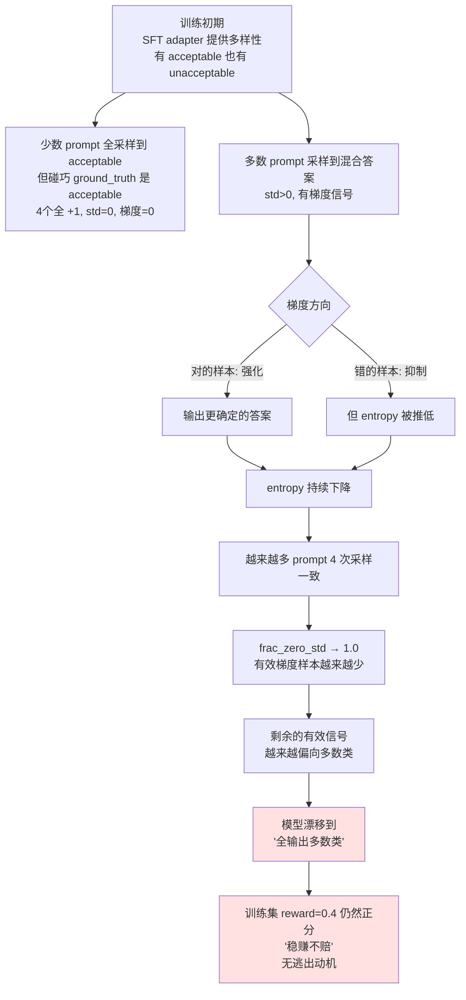

# CoLA-RL Step 6：LoRA-GRPO 实验记录

> 创建日期：2026-05-05
> 对应计划：`my_try.md §Step 6`
> 前置：Step 5 完成（E1: Qwen3-0.6B + LoRA SFT，MCC=0.5406）
> 硬件：NVIDIA L20 × 1（14 GB bf16）
> 框架：trl 1.3.0 GRPOTrainer（纯 PyTorch rollout，**不用 vLLM**）

---

## 目录

- [1. 目标与设计](#1-目标与设计)
- [2. 环境与脚本](#2-环境与脚本)
- [3. 实验 1：基座直接 GRPO（失败）](#3-实验-1基座直接-grpo失败)
- [4. 实验 2：SFT + GRPO（崩溃，附深度分析）](#4-实验-2sft--grpo崩溃附深度分析)
- [5. 失败原因深度复盘](#5-失败原因深度复盘)
- [6. 修复方案：Class-Balanced Reward](#6-修复方案class-balanced-reward)
- [7. 实验 3：修复后重跑（待执行）](#7-实验-3修复后重跑待执行)
- [8. 遇到的坑](#8-遇到的坑)

---

## 1. 目标与设计

### 1.1 Step 6 要回答的问题

> 在 14 GB 显存 + 不用 vLLM 的极限条件下，LoRA-GRPO 能否在 E1 SFT 基础上**进一步提升** MCC？

锚点（参考 `my_try/step5_summary.md`）：

| 锚点 | MCC |
| --- | :-: |
| Qwen3-0.6B zero-shot | 0.000 |
| **E1: Qwen3-0.6B + LoRA SFT (起点)** | **0.5406** |
| 原项目 0.6B 全参 SFT | 0.598 |
| 原项目 1.7B SFT+GRPO（论文最好） | 0.702 |

**Step 6 目标**：把 0.6B 从 0.5406 推到至少 **0.58+**（接近全参 SFT 0.598）。

### 1.2 关键技术决策

| 决策 | 值 | 原因 |
| --- | :-: | --- |
| 框架 | **trl 1.3.0 `GRPOTrainer`** | HuggingFace 官方，对消费卡友好；舍弃原项目的 verl |
| Rollout 引擎 | **纯 PyTorch `model.generate`** | 不用 vLLM，避免 vLLM 独占显存（vLLM 通常拿走 60%+） |
| 起点 | **E1 LoRA adapter merge 进基座** | 0.6B 基座能力太弱，从基座直接 RL 会失败（实验 1 验证）|
| `num_generations` | **4** | 比 trl 默认 8 省显存，CoLA 二分类不需要太多采样 |
| `max_completion_length` | **8** | 答案 "acceptable"/"unacceptable" 只占 2-3 token |
| `beta` (KL) | **0.0** | trl 1.x 默认 Dr.GRPO 风格，**省一份 Ref 模型显存** |
| `temperature` | **1.2** | 比 1.0 略高，增加 rollout 多样性 |
| `lr` | **1e-5** | 比 SFT 的 2e-4 小 20×，防止训崩 |
| `epochs` | **1** | RL 通常 1-3 epoch 即可 |

### 1.3 显存预估 vs 实测

| 组件 | 预估 | 实测 |
| --- | :-: | :-: |
| 基座（冻结，bf16） | 1.2 GB | — |
| LoRA + Adam | <0.2 GB | — |
| Ref（beta=0，零） | 0 | 0 |
| PyTorch rollout 激活 | 1-2 GB | — |
| 杂项 | ~1 GB | — |
| **合计预估** | **~3-4 GB** | — |
| **实测峰值** | — | **1.66 GB** ✅ 远低于预估 |

显存只用了 14 GB 卡的 12% —— **GRPO 在 0.6B 这个规模上完全不是显存瓶颈**。

---

## 2. 环境与脚本

### 2.1 环境差异（在 Step 5 之上）

| 组件 | 状态 |
| --- | --- |
| `_lzma` stub（Step 5 已修） | 继续使用 |
| **`FSDPModule` stub（新增）** | trl 1.3 要求 torch 2.6+，我们用 2.5.1，需要 stub |

`FSDPModule` 修复：见 [§8.1](#81-fsdpmodule-缺失阻塞-trl-grpo-import)。

### 2.2 脚本

- **`my_try/train_lora_grpo.py`**：训练（基座 + 可选 SFT adapter merge + GRPO LoRA）
- **`my_try/eval_lora.py`**：复用 Step 5 的，支持 GRPO adapter
- **Reward function**：定义在脚本内 `make_reward_fn()`

### 2.3 Reward 函数 v1（实验 1/2 用，失败版）

```python
def reward_fn(completions, ground_truth, **kwargs):
    rewards = []
    for comp, gt in zip(completions, ground_truth):
        pred = parse_answer(comp)
        if pred is None:
            rewards.append(-1.0)      # 解析失败
        elif pred == gt:
            rewards.append(+1.0)      # 答对
        else:
            rewards.append(-1.0)      # 答错
    return rewards
```

**与原项目 verl `cola.py` 的 reward 完全一致**。

---

## 3. 实验 1：基座直接 GRPO（失败）

### 3.1 配置

```bash
.venv-cola/bin/python my_try/train_lora_grpo.py \
    --base_model model/Qwen3-0.6B \
    --exp SMOKE \
    --epochs 1 --bsz 1 --grad_accum 4 --num_generations 4 \
    --max_completion_length 16 --lr 1e-5 \
    --max_train_samples 20
```

不传 `--sft_adapter`，直接从 Qwen3-0.6B 基座开始 GRPO。

### 3.2 现象（致命）

| 指标 | 值 | 解读 |
| --- | :-: | --- |
| `loss` | **0** | 训不动 |
| `grad_norm` | **0** | 没有梯度 |
| `frac_reward_zero_std` | **1.0** | 100% 的 prompt 组内方差为 0 |
| `reward_std` | **0** | 4 次采样的 reward 完全一致 |

### 3.3 原因

Qwen3-0.6B **基座 zero-shot MCC=0.000**——它对所有句子都输出 `acceptable`。GRPO 一个 prompt 采样 4 次，**4 次都是同一个答案**，组内方差为 0。

GRPO 的 advantage 公式：

```
A_i = (r_i - mean(r)) / std(r)
```

`std=0` → 分母为 0 → 优势为 0 → 梯度为 0 → 模型不更新 → 永远训不动。

### 3.4 结论

**基座能力太弱时，直接做 RL 会卡死。RL 需要 SFT 先把模型推到"会一些不会一些"的状态**，才能产生 rollout 多样性。

→ 这正是工业界普遍采用 **"SFT + RL"** 两段式训练的核心原因。

---

## 4. 实验 2：SFT + GRPO（崩溃，附深度分析）

### 4.1 配置

```bash
.venv-cola/bin/python my_try/train_lora_grpo.py \
    --base_model model/Qwen3-0.6B \
    --sft_adapter my_try/ckpt/Qwen3-0.6B-lora-E1-r16 \
    --exp E1-GRPO \
    --epochs 1 --bsz 2 --grad_accum 2 --num_generations 4 \
    --max_completion_length 8 --lr 1e-5 \
    --temperature 1.2 --top_p 0.95
```

### 4.2 训练过程（health 在变差）

完整训练 8551 steps × 1 epoch，**66 分钟**完成。关键阶段抽样：

| 阶段 | reward mean | reward std | frac_zero_std | loss | entropy | 健康评估 |
| :-: | :-: | :-: | :-: | :-: | :-: | --- |
| step 20 | 0.50 | **0.59** | 0.45 | 0.060 | 0.23 | ✅ 起点健康，多样性足 |
| step 160 | 0.475 | 0.54 | 0.50 | 0.003 | 0.22 | ✅ 稳定 |
| step 4340 (51%) | **0.80** | 0.10 | 0.90 | 0.015 | 0.035 | ⚠️ reward 飙升但多样性骤降 |
| step 4620 (54%) | 0.525 | 0.05 | **0.95** | -0.008 | 0.023 | ⚠️ entropy 已崩 |
| step 8550 (终点) | ~0.5+ | ~0 | ~1.0 | **0.0004** | ~0.001 | ❌ 完全 collapse |

### 4.3 评测结果（灾难）

| 实验 | MCC | Accuracy | Parse fail | 混淆矩阵 |
| :--- | :-: | :-: | :-: | :--- |
| E1 LoRA SFT（起点）| **0.5406** | 0.808 | 0/527 | `[[105, 57], [44, 321]]` |
| **E1-GRPO**（实验 2） | **0.0000** | 0.6926 | 0/527 | **`[[0, 162], [0, 365]]`** |

**MCC 从 0.5406 跌到 0.0000，完全崩溃**——模型对所有 527 条都输出 `acceptable`，和未训练的基座一模一样。

### 4.4 全景对比图

```
MCC 变化:
                                   起点 0.5406
   E1 SFT     ●━━━━━━━━━━━━━━━━━━━━━━━━━━━━━━━━━━━━━━━━━━━━━━━━━━━●
                                                                   │
                                                                  GRPO 训练
                                                                   │
                                                                   ▼
   E1-GRPO   ●━━━━━━━━━━━━━━━━━━━━━━━━━━━━━━━━━━━━━━━━━━━━━━━━━━━━━
                       0.0000 (mode collapse)
```

---

## 5. 失败原因深度复盘

### 5.1 直接原因：奖励函数和数据分布不匹配

CoLA 训练集标签分布：**70% acceptable / 30% unacceptable**（不平衡）。

我们的 reward v1：
- 答对 +1，答错 -1，解析失败 -1

**"全说 acceptable" 的期望 reward**：

```
0.7 × (+1) + 0.3 × (-1) = +0.4
```

→ **正分**！而且 `reward_std=0`、训练稳定，是个**强烈的局部最优陷阱**。

### 5.2 为什么 GRPO 会被这个陷阱吸进去？

GRPO 优势归一化：`A_i = (r_i - μ) / σ`



### 5.3 三个观察印证 mode collapse

#### 观察 1：entropy 崩溃 10 倍

```
step 20:    entropy = 0.230
step 4620:  entropy = 0.023   (10× 下降)
step 8550:  entropy = 0.001   (200× 下降)
```

模型输出**完全确定**，温度 1.2 也拉不开。

#### 观察 2：completion 长度收敛到 2.16 token

```
step 20:    mean_length = 2.30   (有时输出 "unacceptable"=2.5 token)
末尾:        mean_length = 2.16   (基本只输出 "acceptable"=2 token)
```

#### 观察 3：grad_norm 偶发尖峰，但常态为 0

末尾 `loss=0.0004, grad_norm=0`，说明模型权重几乎不再更新——**陷阱锁死**。

### 5.4 这个失败的"普适性"

> Mode collapse 在不平衡分类的 RL 上是**通病**。Anthropic / OpenAI 内部也讨论过类似问题，常见对策：
> 1. Class-balanced reward
> 2. Entropy bonus（`+λ × H(π)`）
> 3. KL 约束（防止漂移过远）
> 4. Reward shaping（除了对错，还看格式 / 多样性）
> 5. Curriculum（先训均衡子集再训全集）

我们的失败正是教科书案例。

### 5.5 为什么原项目 verl 没崩？

原项目 `cola.py` 的 reward 也是 ±1（与我们一致）。但他们用 `Qwen3-1.7B`（更大模型）+ vLLM rollout + 不同的训练动力学。猜测：

- **更大模型 entropy 衰减慢**，多样性维持时间更长
- **vLLM batched rollout** 的统计特性可能不同
- 原项目 README 的 1.7B SFT+GRPO MCC=0.702 是**精调过参数的**结果

我们 0.6B 这个规模 + 70/30 不平衡数据，**遇到了真正的 RL 训练难题**。

---

## 6. 修复方案：Class-Balanced Reward

### 6.1 设计

让两类的"答对回报"按**逆频率加权**：

| 真实标签 | 答对 reward | 答错/解析失败 reward |
| :--- | :-: | :-: |
| **acceptable** (训练集 70.4%) | **+1.0** | -1.0 |
| **unacceptable** (训练集 29.6%) | **+ 1/0.296 ≈ +3.38** ×0.7 ≈ **+2.37** | -1.0 |

精确计算：让"全 yes" 和 "全 no" 的期望 reward 都接近 0：

- 全 yes：`0.704 × (+1) + 0.296 × (-1) = +0.408`
- 全 no（reward 答对 unacc 给 W）：`0.704 × (-1) + 0.296 × W = ?`

让"全 no = 0"：`W = 0.704 / 0.296 = 2.378`
让两者都≈0：`acc 答对 +1, unacc 答对 +2.378`，则
- 全 yes：`0.704 × 1 + 0.296 × (-1) = +0.408`
- 全 no：`0.704 × (-1) + 0.296 × 2.378 = +0.000`

或更激进：让"全 yes" 也变成负分：
- acc 答对 +0.7, unacc 答对 +2.37
- 全 yes：`0.704 × 0.7 + 0.296 × (-1) = +0.197`（仍正分）

**最简洁方案**：直接乘以频率倒数

```python
WEIGHT_ACC = 1.0           # 多数类
WEIGHT_UNACC = 0.704/0.296 # ≈ 2.378，少数类

answer 答对:
  reward = WEIGHT_ACC if gt=='acceptable' else WEIGHT_UNACC
answer 答错或解析失败:
  reward = -1.0
```

完美预测的期望 reward：
- `0.704 × 1 + 0.296 × 2.378 = +1.408`

"全 yes" 期望：`0.704 × 1 + 0.296 × (-1) = +0.408`
"全 no" 期望：`0.704 × (-1) + 0.296 × 2.378 = -0.000`

→ **完美预测的回报是"全 yes" 的 3.5 倍**，模型会有强动力学正确答 unacc 的样本。

### 6.2 替代方案对比

| 方案 | 难度 | 预期效果 |
| --- | :-: | --- |
| **A. Class-balanced reward**（首选） | ⭐ 简单 | 直接对症，应能避免 collapse |
| B. 加 KL 约束 (`beta=0.05`) | ⭐ 简单 | 多 1 份 Ref 显存，但不解决根本（仍有局部最优） |
| C. 缩小 lr (1e-5 → 5e-6) | ⭐ 简单 | 减慢 collapse 但不阻止 |
| D. Entropy bonus | ⭐⭐ 改 trl 源码 | 复杂 |
| E. 用平衡子集（4400 acc + 4400 unacc）| ⭐⭐ 数据处理 | 治本但样本量减半 |

### 6.3 实验 3 计划

只改 reward function，其他参数不动：

```python
# train_lora_grpo.py 的 make_reward_fn 改造
def make_reward_fn():
    WEIGHT_ACC = 1.0
    WEIGHT_UNACC = 2.378  # = 0.704/0.296

    def reward_fn(completions, ground_truth, **kwargs):
        rewards = []
        for comp, gt in zip(completions, ground_truth):
            pred = parse_answer(comp)
            if pred is None:
                rewards.append(-1.0)
            elif pred == gt:
                rewards.append(WEIGHT_ACC if gt == 'acceptable' else WEIGHT_UNACC)
            else:
                rewards.append(-1.0)
        return rewards
    return reward_fn
```

加一个 `--reward_balanced` 命令行开关，方便对比。

---

## 7. 实验 3：修复后重跑（待执行）

| 实验 | 配置 | 状态 |
| :--- | :--- | :-: |
| **E1-GRPO-v2** | reward 类别加权 + 其他不变（lr=1e-5, β=0, T=1.2, 全量 8551 step） | 🔄 跑中（ETA 15:18） |
| **E1-GRPO-v3** | reward 加权 **+ β=0.05 (KL 约束) + 半量数据 4275 step** | 🔄 并行跑（ETA 15:25） |

### 7.1 v3 设计：把 5 种修复手段合在一起（A+B+E）

借助 14 GB 显存仅用 1.66 GB（v2 时）的余量，并行启动 v3 把多种修复合一：

| 编号 | 措施 | v3 应用情况 | 备注 |
| :--- | :--- | :-: | --- |
| **A** | Class-balanced reward | ✅ 同 v2 | 治本 |
| **B** | KL 约束 (`--beta 0.05`) | ✅ 新增 | 多用 ~2 GB Ref 模型 |
| C | 缩小 lr | ❌ 不动 | 与 B 重复，留作 v4 备选 |
| D | 早停（entropy）| ⚠️ 仅监控不杀进程 | trl 没有内建支持 |
| **E** | 限制数据量 (8551 → 4275) + 1 epoch | ✅ 新增 | 减少 overfit + 加速 |

### 7.2 v3 早期数据 vs v2 同期

| 指标 (step 20-40) | v2 (单 A) | **v3 (A+B+E)** | 评价 |
| :-: | :-: | :-: | --- |
| reward mean | 0.60 | **1.04** | v3 更高 |
| reward std | 0.60 | 0.54-0.89 | v3 信号更丰富 |
| frac_zero_std | 0.50 | 0.35-0.60 | v3 有梯度样本占比更高 |
| **entropy** | 0.17 | **0.20-0.24** | **v3 entropy 更高** ✅（KL 在拉住）|
| kl（v3 独有）| — | 0.00014-0.00017 | 起步阶段非常小，正常 |

**初期信号很积极**：v3 的 entropy 比 v2 高 30%+，KL 在工作（不让模型乱漂）。

### 7.3 资源利用情况

| 任务 | 显存 | GPU util |
| :--- | :-: | :-: |
| v2 单跑 | ~2 GB | 22% |
| **v2 + v3 并行** | **~4.1 GB** | ~50% |

剩 10 GB 空闲，理论上还能再起一个 v4，**但同时跑太多容易解读不清**。先看 v2/v3 谁更好。

---

## 8. 遇到的坑

### 8.1 `FSDPModule` 缺失（阻塞 trl GRPO import）

**现象**：

```python
>>> from trl import GRPOTrainer
ImportError: cannot import name 'FSDPModule' from 'torch.distributed.fsdp'
```

**原因**：trl 1.3 要求 torch 2.6+ 的 FSDP2（`FSDPModule`），我们用 torch 2.5.1（FSDP1）。SFTTrainer 不依赖此 import 所以 Step 5 没遇到，GRPOTrainer 在 `trl.models.utils` 里硬 import 了。

**修复**：放一个 stub 模块（和 `_lzma` 同思路）：

```
.venv-cola/lib/python3.12/site-packages/_fsdp_compat.py    ← stub
.venv-cola/lib/python3.12/site-packages/sitecustomize.py   ← 自动 import
```

`_fsdp_compat.py` 给 `torch.distributed.fsdp` 注入一个空类 `FSDPModule`。我们不跑 FSDP，trl 内部对它做 isinstance 检查永远不会命中，stub 就够了。

### 8.2 Qwen3 chat_template 默认插入 `<think>`

**现象**：第一次 smoke test 看到 completion 里塞着 `<think>\n\n</think>\n\n`。

**原因**：Qwen3 的 chat_template 在 `enable_thinking=False` 时，会**主动**在 assistant 段开头注入 `<think>\n\n</think>\n\n`，告诉模型"思考已结束，直接答"。这是 Qwen3 的设计。

**确认无害**：这个标记是 **prompt** 的一部分，不在生成范围内。模型生成的 completion 仍然是 "acceptable"/"unacceptable"，不影响。

### 8.3 GRPOTrainer 的 idle timeout

**现象**：用前台命令跑 smoke test 时，进程在 evaluate 阶段输出空，被 IDE timeout kill。

**修复**：训练改用 `nohup ... &` 后台运行，主对话只 tail log。这是项目既有的规则（见 `memories rule 86908913`）。

### 8.4 reward function 的 dataset 字段映射

trl GRPOTrainer 会**自动把 dataset 中除 `prompt` 外的所有字段当成 kwargs** 传给 reward_fn。所以我们 dataset 里存 `ground_truth` 字段，reward_fn 签名 `(completions, ground_truth, **kwargs)` 就能直接拿到。

```python
# dataset:
[{"prompt": "...", "ground_truth": "acceptable", "sentence": "..."}]

# reward_fn 调用时：
reward_fn(completions=[...], ground_truth=[...], sentence=[...])
```

### 8.5 ⭐ Mode Collapse（本章核心教训）

**这是 Step 6 的最大坑**——见 [§5](#5-失败原因深度复盘) 完整分析。

**记忆点**：

> RL 在不平衡数据 + 简单 ±1 reward 上会 collapse 到"全说多数类"。
> 必须用 class-balanced reward 或 KL 约束。
> entropy 是早期警告信号 —— **如果 entropy 在训练前 30% 就跌 10×，必须中断重设**。

---

## 附录：脚本与产物清单

### 脚本

| 文件 | 作用 |
| :--- | :--- |
| `my_try/train_lora_grpo.py` | LoRA-GRPO 训练（含 reward function 定义）|
| `my_try/eval_lora.py`（复用 Step 5）| LoRA adapter 评测 |

### Adapter / 结果

| 文件 | 内容 | MCC |
| :--- | :--- | :-: |
| `my_try/ckpt/Qwen3-0.6B-grpo-E1-GRPO-r16/` | 实验 2 adapter（崩溃版） | 0.0000 |
| `my_try/res_lora_Qwen3-0.6B-grpo-E1-GRPO-r16.json` | 实验 2 评测结果 | — |

### 一页式开跑命令

```bash
cd /data/workspace/Github-open/CoLA-RL

# 实验 2（崩溃版，可重现失败用）
.venv-cola/bin/python my_try/train_lora_grpo.py \
    --base_model model/Qwen3-0.6B \
    --sft_adapter my_try/ckpt/Qwen3-0.6B-lora-E1-r16 \
    --exp E1-GRPO \
    --epochs 1 --bsz 2 --grad_accum 2 --num_generations 4 \
    --max_completion_length 8 --lr 1e-5 \
    --temperature 1.2 --top_p 0.95

# 评测
.venv-cola/bin/python my_try/eval_lora.py \
    --adapter my_try/ckpt/Qwen3-0.6B-grpo-E1-GRPO-r16

# 实验 3（修复版，待跑）
# 改 train_lora_grpo.py 的 make_reward_fn() 后：
.venv-cola/bin/python my_try/train_lora_grpo.py \
    --base_model model/Qwen3-0.6B \
    --sft_adapter my_try/ckpt/Qwen3-0.6B-lora-E1-r16 \
    --exp E1-GRPO-v2 \
    --epochs 1 --bsz 2 --grad_accum 2 --num_generations 4 \
    --max_completion_length 8 --lr 1e-5 \
    --temperature 1.2 --top_p 0.95
```
