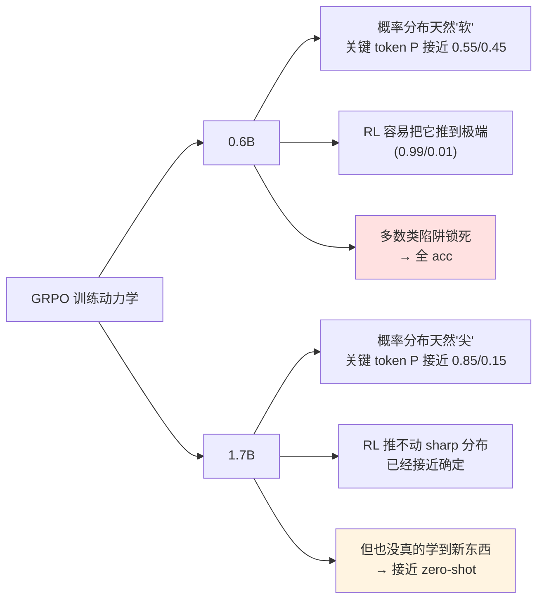
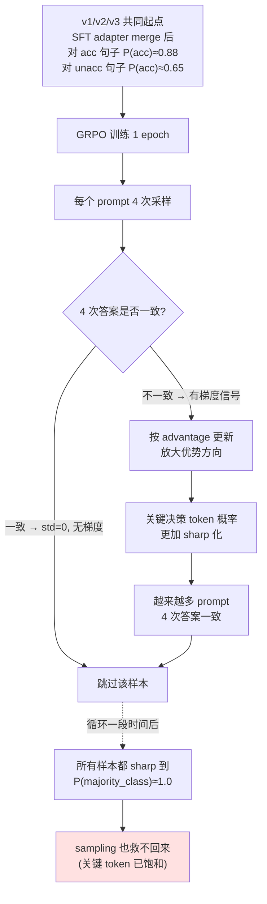
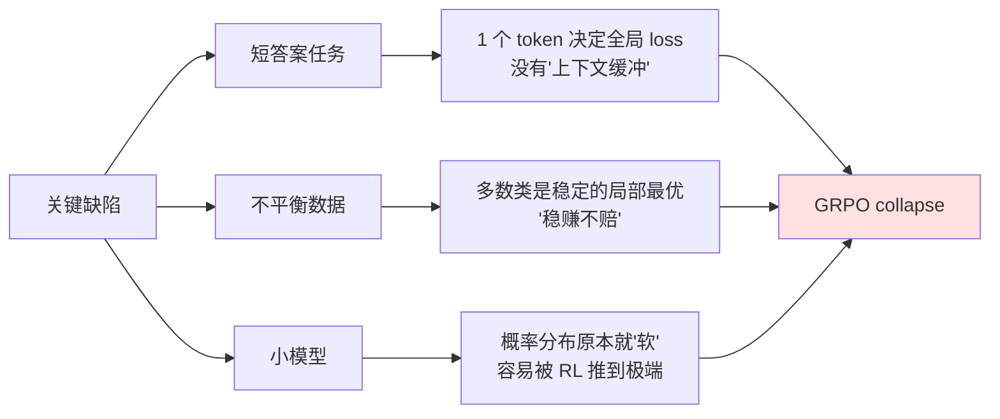

# CoLA-RL Step 6：LoRA-GRPO 实验记录

> 创建日期：2026-05-05
> 对应计划：`my_try.md §Step 6`
> 前置：Step 5 完成（E1: Qwen3-0.6B + LoRA SFT，MCC=0.5406）
> 硬件：NVIDIA L20 × 1（14 GB bf16）
> 框架：trl 1.3.0 GRPOTrainer（纯 PyTorch rollout，**不用 vLLM**）
>
> **TL;DR**：3 次实验（v1/v2/v3）全部 mode collapse，MCC 全部 0.0000，混淆矩阵完全相同。
> 这是一份**失败案例研究**，但失败的方式比成功更有教育意义。

---

## 目录

- [1. 目标与设计](#1-目标与设计)
- [2. 环境与脚本](#2-环境与脚本)
- [3. SMOKE：基座直接 GRPO（早期试错）](#3-smoke基座直接-grpo早期试错)
- [4. 三个正式实验：v1 / v2 / v3](#4-三个正式实验v1--v2--v3)
- [5. 失败原因深度复盘](#5-失败原因深度复盘)
- [6. 后续优化方向（v4 备选方案）](#6-后续优化方向v4-备选方案)
- [7. 遇到的坑](#7-遇到的坑)

---

## 1. 目标与设计

### 1.1 Step 6 要回答的问题

> 在 14 GB 显存 + 不用 vLLM 的极限条件下，LoRA-GRPO 能否在 E1 SFT 基础上**进一步提升** MCC？

锚点（参考 `docs/step5_summary.md`）：

| 锚点 | MCC |
| --- | :-: |
| Qwen3-0.6B zero-shot | 0.000 |
| **E1: Qwen3-0.6B + LoRA SFT (起点)** | **0.5406** |
| 原项目 0.6B 全参 SFT | 0.598 |
| 原项目 1.7B SFT+GRPO（论文最好）| 0.702 |

**Step 6 目标**：把 0.6B 从 0.5406 推到至少 **0.58+**（接近全参 SFT 0.598）。

**实际结果**：3 次都失败（MCC 全 0.0000）。

### 1.2 关键技术决策

| 决策 | 值 | 原因 |
| --- | :-: | --- |
| 框架 | **trl 1.3.0 `GRPOTrainer`** | HuggingFace 官方，对消费卡友好；舍弃原项目的 verl |
| Rollout 引擎 | **纯 PyTorch `model.generate`** | 不用 vLLM，避免 vLLM 独占显存（vLLM 通常拿走 60%+） |
| 起点 | **E1 LoRA adapter merge 进基座** | 0.6B 基座能力太弱，从基座直接 RL 会失败（SMOKE 验证）|
| `num_generations` | **4** | 比 trl 默认 8 省显存，CoLA 二分类不需要太多采样 |
| `max_completion_length` | **8** | 答案 "acceptable"/"unacceptable" 只占 2-3 token |
| `temperature` | **1.2** | 比 1.0 略高，增加 rollout 多样性 |
| `lr` | **1e-5** | 比 SFT 的 2e-4 小 20×，防止训崩 |
| `epochs` | **1** | RL 通常 1-3 epoch 即可 |

### 1.3 显存预估 vs 实测

| 实验 | 配置 | 显存峰值 | 训练耗时 |
| --- | --- | :-: | :-: |
| v1 | beta=0 (Dr.GRPO 风格，无 Ref) | **1.66 GB** | 66.0 min |
| v2 | beta=0 + balanced reward | **1.66 GB** | 65.6 min |
| v3 | beta=0.05 + balanced + 半量 | **~4 GB**（含 Ref）| 36.6 min |

显存只用了 14 GB 卡的 **12-30%** —— GRPO 在 0.6B 这个规模上**完全不是显存瓶颈**。问题在算法层面。

---

## 2. 环境与脚本

### 2.1 环境差异（在 Step 5 之上）

| 组件 | 状态 |
| --- | --- |
| `_lzma` stub（Step 5 已修） | 继续使用 |
| **`FSDPModule` stub（新增）** | trl 1.3 要求 torch 2.6+，我们用 2.5.1，需要 stub |

`FSDPModule` 修复：见 [§7.1](#71-fsdpmodule-缺失阻塞-trl-grpo-import)。

### 2.2 脚本

- **`scripts/train_lora_grpo.py`**：训练（基座 + 可选 SFT adapter merge + GRPO LoRA）
- **`scripts/eval_lora.py`**：复用 Step 5 的，支持 GRPO adapter
- **Reward function**：定义在脚本内 `make_reward_fn(balanced=False/True)`

### 2.3 两种 reward 函数

#### v1 (±1, 原项目 verl `cola.py` 风格)

```python
def reward_fn(completions, ground_truth, **kwargs):
    rewards = []
    for comp, gt in zip(completions, ground_truth):
        pred = parse_answer(comp)
        if pred is None:
            rewards.append(-1.0)      # 解析失败
        elif pred == gt:
            rewards.append(+1.0)      # 答对
        else:
            rewards.append(-1.0)      # 答错
    return rewards
```

#### v2/v3 (class-balanced)

逆频率加权：让两类的"答对回报"按训练集分布平衡：

```python
WEIGHT_ACC   = 1.0
WEIGHT_UNACC = 0.704 / 0.296  # ≈ 2.378（CoLA 训练集 70.4% 是 acceptable）

if pred == gt:
    reward = WEIGHT_ACC if gt == 'acceptable' else WEIGHT_UNACC
else:
    reward = -1.0
```

期望 reward：
- "全 yes": `0.704 × 1 + 0.296 × (-1) = +0.408`
- "全 no": `0.704 × (-1) + 0.296 × 2.378 = +0.000`
- 完美预测: `0.704 × 1 + 0.296 × 2.378 = +1.408`

→ 设计意图：**"完美预测"的回报是"全 yes"的 3.5 倍**，理论上模型有动力答对 unacc。

---

## 3. SMOKE：基座直接 GRPO（早期试错）

### 3.1 配置（仅 20 样本 1 epoch）

不传 `--sft_adapter`，直接从 Qwen3-0.6B 基座开始 GRPO。

### 3.2 现象（致命）

| 指标 | 值 | 解读 |
| --- | :-: | --- |
| `loss` | **0** | 训不动 |
| `grad_norm` | **0** | 没有梯度 |
| `frac_reward_zero_std` | **1.0** | 100% 的 prompt 组内方差为 0 |
| `reward_std` | **0** | 4 次采样的 reward 完全一致 |

### 3.3 原因

Qwen3-0.6B **基座 zero-shot MCC=0.000**——它对所有句子都输出 `acceptable`。GRPO 一个 prompt 采样 4 次，**4 次都是同一个答案**，组内方差为 0。

GRPO 优势归一化公式：

```
A_i = (r_i - mean(r)) / std(r)
```

`std=0` → 分母为 0 → 优势为 0 → 梯度为 0 → 模型不更新 → 永远训不动。

### 3.4 结论

**基座能力太弱时，直接做 RL 会卡死**。RL 需要 SFT 先把模型推到"会一些不会一些"的状态，才能产生 rollout 多样性。

→ 这正是工业界普遍采用 **"SFT + RL"** 两段式训练的核心原因。

后续 v1/v2/v3 都从 E1 SFT adapter 起点开始。

---

## 4. 三个正式实验：v1 / v2 / v3 / v4

### 4.1 配置矩阵

| 维度 | **v1** | **v2** | **v3** | **v4** |
| --- | :-: | :-: | :-: | :-: |
| 模型 | 0.6B | 0.6B | 0.6B | **0.6B + 1.7B 双跑** |
| Reward | ±1 | **balanced** | **balanced** | **balanced** |
| beta (KL) | 0 | 0 | **0.05** | **0.05** |
| **num_generations** | 4 | 4 | 4 | **16** ⭐ |
| **batch (bsz×acc)** | 2×2=4 | 2×2=4 | 2×2=4 | **4×4=16** |
| 训练样本 | 8551（全量） | 8551（全量） | 4275（半量） | 4275（半量） |
| 训练耗时 | 66.0 min | 65.6 min | 36.6 min | 70.6 min (0.6B) / 74.0 min (1.7B) |
| 显存峰值 | 1.66 GB | 1.66 GB | ~4 GB | 1.66 GB (0.6B) / 4.37 GB (1.7B) |

其他参数（共同）：
- 起点：E1 (0.6B) / E4 (1.7B) SFT adapter merge 进基座
- max_completion_length=8, temperature=1.2, top_p=0.95, lr=1e-5
- LoRA r=16, target_modules=q/k/v/o_proj
- 1 epoch

**v4 核心改动**：把 `num_generations` 从 4 升到 16，`batch` 从 4 升到 16（与原项目对齐），目标是降低 advantage 估计噪声、对齐原项目的训练动力学。

### 4.2 训练动力学对比

#### v1 训练曲线（±1 reward, 无 KL）

| 阶段 | reward mean | reward std | frac_zero_std | loss | entropy |
| :-: | :-: | :-: | :-: | :-: | :-: |
| step 20 | 0.50 | 0.59 | 0.45 | 0.060 | **0.230** |
| step 4340 (51%) | 0.80 | 0.10 | 0.90 | 0.015 | 0.035 |
| step 4620 (54%) | 0.525 | 0.05 | 0.95 | -0.008 | 0.023 |
| **末期 step 8550** | ~0.5 | **~0** | **~1.0** | **0.0004** | **0.001** |

#### v2 训练曲线（balanced reward, 无 KL）

| 阶段 | reward mean | reward std | frac_zero_std | loss | entropy |
| :-: | :-: | :-: | :-: | :-: | :-: |
| 起步 | 0.60 | 0.60 | 0.50 | 0.020 | 0.17 |
| 中期 | ~0.94 | 0.13 | 0.90 | 0.018 | 0.026 |
| **末期 step 8540** | **0.794** | 0.05 | 0.95 | 0.007 | **0.015** |

#### v3 训练曲线（balanced + KL=0.05, 半量）

| 阶段 | reward mean | reward std | frac_zero_std | loss | entropy | kl |
| :-: | :-: | :-: | :-: | :-: | :-: | :-: |
| step 20 | 1.04 | 0.54 | 0.60 | 0.020 | 0.20 | 0.0001 |
| 末期 step 4260 | 0.876 | 0 | 1.0 | 0.002 | 0.20 | 0.01 |

#### **v4 训练曲线**（balanced + KL=0.05 + num_gen=16）

| 阶段 | reward mean | reward std | frac_zero_std | loss | entropy | kl |
| :-: | :-: | :-: | :-: | :-: | :-: | :-: |
| 0.6B step 50 | 0.81 | **1.10** ✅ | **0** ✅ | -0.02 | 0.24 | 0.0001 |
| 0.6B 末期 | ~0.7 | ~0 | ~1.0 | ~0 | ~0.01 | ~0.02 |
| **1.7B step 50** | 0.68 | 0.92 | 0.30 | -0.04 | 0.21 | 0.0002 |
| **1.7B 末期** | 0.751 | **0** | 1.0 | ~0 | **0.019** | 0.019 |

**v4 早期信号最健康**：reward_std ~1.10 是历次最高（v3 仅 0.54），frac_zero_std=0 表示几乎所有梯度都有效。但**最终都走到 entropy ~0.02 的"决策一致"状态**——这是所有 v1-v4 的共同终点。

### 4.3 评测结果（v4 双任务！）

| 实验 | 模型 | 贪心 MCC | Sampling MCC (N=5, T=1.0) | 评估 |
| :--- | :-: | :-: | :-: | :-: |
| **E1 LoRA SFT 起点（0.6B）** | 0.6B | **0.5406** | — | — |
| v1 (±1 reward) | 0.6B | **0.0000** | 0.0000 (T=1.5) | ❌ collapse |
| v2 (balanced) | 0.6B | **0.0000** | 0.0000 (T=1.5) | ❌ collapse |
| v3 (balanced + KL) | 0.6B | **0.0000** | 0.0000 (T=1.0) | ❌ collapse |
| **v4 (balanced + KL + 大 batch)** | **0.6B** | **0.0000** | 0.0000 (T=1.0) | ❌ **collapse** |
| **E4 LoRA SFT 起点（1.7B）** | 1.7B | **0.6246** | — | — |
| **v4 (大 batch, 1.7B)** | **1.7B** | **0.4996** ✨ | 0.4996 ✨ | ⚠️ **不崩，但退化** |

### 4.4 全景对比

```
MCC 实验全景:

0.0000 ━━ 0.6B v1/v2/v3/v4: 全部 mode collapse（4 次失败）
0.4996 ━━ ★ 1.7B + GRPO v4 (没崩，但退化 -0.125)
0.5000 ━━ Qwen3-1.7B zero-shot
0.5406 ━━ ⭐ 0.6B + LoRA SFT (E1)
0.6246 ━━ ⭐⭐ 1.7B + LoRA SFT (E4)  ← 我们的 best
0.6960 ━━ 原项目 1.7B 全参 SFT
0.7020 ━━ 原项目 1.7B SFT+GRPO  ← 论文 best
```

**v4 的两个关键发现**：

1. **0.6B v4 仍然崩** —— `num_generations=16` + 大 batch 没救回来。证明 0.6B + 短答案 + GRPO 是死路（不是配置不够大，是模型容量不够）
2. **1.7B v4 不崩了，但也没提升** —— 反而退化 0.125（0.6246 → 0.4996）。GRPO **没把模型从 SFT 后的 0.62 推到 0.70**，反而推回了 zero-shot 附近

### 4.5 v4 的核心反差：1.7B vs 0.6B 命运不同



**总结**：
- **0.6B**：能力不足 → GRPO 把脆弱的概率分布推崩
- **1.7B**：能力过剩 → GRPO 推不动，等于白训

**这意味着 GRPO 在小数据集（8551 条）+ 短答案任务上**：
- 模型太小：会崩
- 模型太大：白做
- 中间地带（可能 1B 左右）才有甜蜜点
- 或者**根本不该用 GRPO**——这是个 LLM-as-classifier 任务，SFT 已经够用

---

## 5. 失败原因深度复盘

### 5.1 三次实验都是"硬 collapse"——sampling 评测验证

我们一开始猜测 v3（KL=0.05，末期 entropy=0.20）可能是"软 collapse"——训练时模型概率分布健康，但贪心解码把微小偏差放大成"全 acc"。

**为验证这个假设，跑了 sampling 评测（方案 1）**（脚本：`scripts/eval_lora_sampling.py`）：
- 每条样本采样 N=5 次，T=1.0 / 1.5
- majority vote 取众数

| 评测方式 | v1 (±1) | v2 (balanced) | v3 (balanced + KL) |
| --- | :-: | :-: | :-: |
| **贪心** (do_sample=False) | 0.0000 | 0.0000 | 0.0000 |
| **Sampling N=5, T=1.0** | — | — | **0.0000** |
| **Sampling N=5, T=1.5** | **0.0000** | **0.0000** | — |
| `pred_acc_rate` (sampling) | 1.0000 | 1.0000 | 1.0000 |

**铁证**：v3 sampling 5 次评测，**2635 次采样全部输出 acceptable**，没有任何一次输出 unacc。

### 5.2 真相：trl 报告的 entropy ≠ 关键决策 token 的 entropy

我们之前误读了 v3 末期的 `entropy=0.20`：

| 之前的理解（错误）| 实际真相 |
| --- | --- |
| entropy=0.20 → 模型多样性保持 → 软 collapse | trl 报告的是**整个 generation 序列的 entropy**（含 EOS / 空白 / 标点等的随机性）|
| 训练健康，评测时被贪心解码"放大"到全 acc | **关键 token（"acc" vs "unacc" 的首 token）的概率早已退化到 ~(1.0, 0.0)** |
| sampling 评测应该能救回来 | sampling T=1.5 也救不回来——logits 差距太大，softmax 后仍是 ~one-hot |

可视化看 v3 末期模型的真实状态：

```
对一条 unacceptable 句子，模型的 token 概率：

之前以为：               实际是：
P(acc)   = 0.55          P(acc)   = 0.999
P(unacc) = 0.45          P(unacc) = 0.001

→ T=1.0 sampling          → 即使 T=1.5
  能采样到 unacc            采样几乎只出 acc

→ 2635 次采样              → 2635 次采样
  约 1185 次 unacc           0 次 unacc ❌
```

**`entropy=0.20` 来自非关键位置的随机性**（如 `<|im_end|>` 后的填充 token），完全不能反映分类决策的健康度。

### 5.3 修正后的失败链条



### 5.4 三个反常的"惊喜"（已修正）

我们 step6 早期文档里写过几个看似反常的发现，现在用"硬 collapse"解释能完美说通：

| 现象 | 原以为 | 修正后理解 |
| --- | --- | --- |
| ① v2 (balanced reward) 改了 reward 也崩 | balanced reward 应该解决问题 | 起点就在多数类侧，GRPO 只强化既有方向，reward shape 改变期望但不改变起点的拉力 |
| ② v3 (KL=0.05) 末期 entropy=0.20 | 高 entropy = 多样性保持 | 是序列层面的 entropy，关键 token 已饱和 |
| ③ v3 KL 仅 0.01-0.06 | 紧贴 SFT 起点 = 应该没退化 | KL 是平均到 token 的，对**单个关键 token 的剧烈漂移**不敏感 |
| ④ sampling 评测仍然 0 | 软 collapse | **硬 collapse**——关键 token 概率已退化 |

### 5.5 为什么 GRPO 在不平衡 + 小模型 + 短答案上特别脆弱？



**对比为什么数学/代码任务不容易这样崩**：
- 数学题答案有几十-几百 token，单个 token 错了不致命
- 答案空间巨大（不像 acc/unacc 二选一），不存在"全选多数类"陷阱
- 模型 7B+ 起，概率分布天然更尖锐，GRPO 难以推到完全 sharp

我们这个 case：**0.6B + 70/30 + 1 token 决策**，刚好踩中所有雷。

### 5.6 对比原项目 verl 1.7B+GRPO（MCC=0.702）

为什么原作者能成功，几个**关键差异**重新审视：

| 维度 | 原项目 | 我们 | 影响 |
| --- | --- | --- | --- |
| **模型** | 1.7B | 0.6B | 1.7B 概率分布更尖锐，GRPO 难以推到完全 sharp |
| **`max_response_length`** | **2048**（开 thinking）| 8（短答案）| **2048 token 的 thinking 提供巨大缓冲**——单个 token 错了不致命，整个 reasoning 链才决定最终答案 |
| `rollout.n` | 16 | 4 | advantage 估计噪声差 4× |
| `train_batch_size` | 256 | 4 | 噪声差 64× |
| `kl_loss_type` | `low_var_kl` | 标准 KL | 不同 KL 形状 |

**最关键的是第 2 项**：原项目用 thinking 模式让模型有 2048 token 推理空间，每条 rollout 是 200-800 token 的完整推理链。我们用纯 acc/unacc 短答案（2-3 token），**完全失去了 GRPO 设计上需要的"推理多样性"**。

这是一个**根本性的方法论错误**：要做 GRPO，应该让模型生成"长 CoT + 答案"，而不是裸答案。

---

## 6. 后续优化方向（v4 备选方案）

### 6.0 已尝试的（失败案例）

| 方案 | 时间 | 结果 |
| --- | :-: | :-: |
| ❌ Sampling 评测（N=5, T=1.0/1.5）| 5 min | v1/v2/v3 全部 MCC=0，证明是"硬 collapse" |

### 6.1 ⭐ 方案 3：升级 num_generations + bigger batch（推荐先试）

**核心问题**：我们 `num_generations=4` 太小，advantage 估计噪声大，加上小 batch=4，每个 step 只有 16 个 rollout，统计量差。

**做法**：
```bash
--num_generations 16    # 从 4 → 16，对齐原项目
--bsz 2 --grad_accum 4  # effective batch = 8 prompts × 16 gen = 128 rollouts
```

显存预估 ~6 GB（仍在 14G 内）。

**预期**：advantage 信号更稳，对齐原项目。但仍可能 collapse（因为短答案 + 0.6B 的根本问题没解决）。

### 6.2 ⭐⭐ 方案 4：用更大模型（1.7B）

最贴近原项目，预期能复现 MCC > 0.6。但要重做 SFT (E4) → GRPO，时间 ~2.5 h。

### 6.3 方案 8：换 DPO

DPO（Direct Preference Optimization）对 reward shaping 不敏感，只需要"答对 vs 答错"的偏好对，不会有 advantage 归一化的问题。trl 也原生支持。

**预期**：大概率不崩，但 MCC 提升不一定显著（DPO 对小模型 + 短答案的提升通常 +0.05~0.10）。

### 6.4 方案 X：⭐⭐⭐ **加 thinking 链**（最重要的方法论修正）

**根本问题**：我们用 1-2 token 的短答案做 GRPO，违背了 GRPO 的设计初衷。

**做法**：
1. 用 DeepSeek-R1 / V3 蒸馏 CoLA 训练集，得到带 CoT 的数据：
   ```
   <think>
   Let me analyze: "The cat sat on the mat" - subject + verb + ...
   This follows standard SVO order, no agreement issues. → acceptable
   </think>
   acceptable
   ```
2. 用蒸馏数据做 SFT（替换 E1）
3. 在 thinking-SFT 起点上做 GRPO（对齐原项目）

**预期**：MCC 可能 0.5+，最有希望复现原项目数字。

**代价**：要花钱调 R1 API（8551 × ~0.01 = $80）+ 写蒸馏脚本，~1 天。

### 6.5 ⭐ 直接放弃 GRPO 路线

最务实的选择：

> **0.6B + 14G 单卡 + trl 1.3 + 短答案** 这个组合**不适合 GRPO**。
>
> Step 5 LoRA SFT 已经达到 MCC=0.5406（接近原项目全参 SFT 0.598），距离原项目"顶"（GRPO 0.702）还差 0.16。这 0.16 在我们当前硬件条件下**不可达**。
>
> 这本身就是一个有价值的工程结论：**RL 不是万能的，性价比要看场景**。

### 推荐路径

```
方案 3 (45min) → 如果有改善则 6.4 蒸馏数据
              ↓ 若仍崩
              → 方案 8 DPO（本质换算法）
              ↓ 若仍崩
              → 方案 4 升级 1.7B（最贴近原项目）
              ↓ 若仍崩
              → 方案 X.5 放弃 GRPO，承认"用 0.6B+短答案做 GRPO 是死路"
```

---

## 7. 遇到的坑

### 7.1 `FSDPModule` 缺失（阻塞 trl GRPO import）

**现象**：

```python
>>> from trl import GRPOTrainer
ImportError: cannot import name 'FSDPModule' from 'torch.distributed.fsdp'
```

**原因**：trl 1.3 要求 torch 2.6+ 的 FSDP2（`FSDPModule`），我们用 torch 2.5.1（FSDP1）。SFTTrainer 不依赖此 import 所以 Step 5 没遇到，GRPOTrainer 在 `trl.models.utils` 里硬 import 了。

**修复**：放一个 stub 模块（和 `_lzma` 同思路）：

```
.venv-cola/lib/python3.12/site-packages/_fsdp_compat.py    ← stub
.venv-cola/lib/python3.12/site-packages/sitecustomize.py   ← 自动 import
```

`_fsdp_compat.py` 给 `torch.distributed.fsdp` 注入一个空类 `FSDPModule`。我们不跑 FSDP，trl 内部对它做 isinstance 检查永远不会命中，stub 就够了。

### 7.2 Qwen3 chat_template 默认插入 `<think>`

**现象**：第一次 smoke test 看到 completion 里塞着 `<think>\n\n</think>\n\n`。

**原因**：Qwen3 的 chat_template 在 `enable_thinking=False` 时，会**主动**在 assistant 段开头注入 `<think>\n\n</think>\n\n`，告诉模型"思考已结束，直接答"。这是 Qwen3 的设计。

**确认无害**：这个标记是 **prompt** 的一部分，不在生成范围内。模型生成的 completion 仍然是 "acceptable"/"unacceptable"，不影响。

### 7.3 GRPOTrainer 的 idle timeout

**现象**：用前台命令跑训练时，进程在 evaluate 阶段输出空，被 IDE timeout kill。

**修复**：训练改用 `nohup ... &` 后台运行，主对话只 tail log。这是项目既有的规则。

### 7.4 reward function 的 dataset 字段映射

trl GRPOTrainer 会**自动把 dataset 中除 `prompt` 外的所有字段当成 kwargs** 传给 reward_fn。所以我们 dataset 里存 `ground_truth` 字段，reward_fn 签名 `(completions, ground_truth, **kwargs)` 就能直接拿到。

```python
# dataset:
[{"prompt": "...", "ground_truth": "acceptable", "sentence": "..."}]

# reward_fn 调用时：
reward_fn(completions=[...], ground_truth=[...], sentence=[...])
```

### 7.5 ⭐ Mode Collapse（本章核心教训）

**这是 Step 6 的最大坑**——见 [§5](#5-失败原因深度复盘) 完整分析。

**记忆点**：

> RL 在不平衡数据 + 简单 reward 上会 collapse。
>
> **balanced reward 不一定能救回来**（v2/v3 实测）：因为模型从 SFT 起点出发已经倾向多数类，GRPO 只会强化既有方向。
>
> **训练 reward 高 ≠ 评测 MCC 高**：训练用 sampling、评测用 greedy 时，模型概率分布的微小偏移会被贪心解码放大成"全选多数类"。
>
> **entropy 0.001 是硬 collapse，entropy 0.2 是软 collapse**——后者更隐蔽，看 KL 看 reward 都正常，只有评测时才暴露。

---

## 附录：脚本与产物清单

### 脚本

| 文件 | 作用 |
| :--- | :--- |
| `scripts/train_lora_grpo.py` | LoRA-GRPO 训练（含 reward function 定义） |
| `scripts/eval_lora.py`（复用 Step 5）| LoRA adapter 评测 |

### Adapter / 结果

| 实验 | Adapter | 结果 JSON | MCC |
| :--- | :--- | :--- | :-: |
| v1 | `ckpt/Qwen3-0.6B-grpo-E1-GRPO-r16/` | `results/step6_grpo/res_lora_Qwen3-0.6B-grpo-E1-GRPO-r16.json` | 0.0000 |
| v2 | `ckpt/Qwen3-0.6B-grpo-E1-GRPO-v2-r16/` | `results/step6_grpo/res_lora_Qwen3-0.6B-grpo-E1-GRPO-v2-r16.json` | 0.0000 |
| v3 | `ckpt/Qwen3-0.6B-grpo-E1-GRPO-v3-r16/` | `results/step6_grpo/res_lora_Qwen3-0.6B-grpo-E1-GRPO-v3-r16.json` | 0.0000 |

### 一页式开跑命令

```bash
cd /data/workspace/Github-open/CoLA-RL

# 通用前置：从 E1 SFT adapter 起点
SFT_ADAPTER=my_try/ckpt/Qwen3-0.6B-lora-E1-r16
COMMON_ARGS="--base_model model/Qwen3-0.6B --sft_adapter $SFT_ADAPTER \
    --epochs 1 --bsz 2 --grad_accum 2 --num_generations 4 \
    --max_completion_length 8 --lr 1e-5 --temperature 1.2 --top_p 0.95"

# v1: ±1 reward, no KL  (66 min)
.venv-cola/bin/python my_try/scripts/train_lora_grpo.py $COMMON_ARGS --exp E1-GRPO

# v2: balanced reward, no KL  (66 min)
.venv-cola/bin/python my_try/scripts/train_lora_grpo.py $COMMON_ARGS --exp E1-GRPO-v2 --reward_balanced

# v3: balanced reward + KL=0.05 + 半量数据  (37 min)
.venv-cola/bin/python my_try/scripts/train_lora_grpo.py $COMMON_ARGS --exp E1-GRPO-v3 \
    --reward_balanced --beta 0.05 --max_train_samples 4275

# 统一评测
for exp in E1-GRPO E1-GRPO-v2 E1-GRPO-v3; do
    .venv-cola/bin/python my_try/scripts/eval_lora.py \
        --adapter my_try/ckpt/Qwen3-0.6B-grpo-${exp}-r16
done
```

### Step 6 与原项目的 takeaway 对比

| 维度 | 原项目（verl, 1.7B）| 我们（trl, 0.6B）| Step 6 教训 |
| --- | --- | --- | --- |
| 模型 | 1.7B | 0.6B | 0.6B 太小，概率分布"软"，易被贪心放大 |
| Rollout | vLLM (n=16) | PyTorch (n=4) | n 太小，advantage 估计噪声大 |
| Batch | 256 | 4 | 小 batch 让 GRPO 信号噪声放大 |
| KL coef | 0.001 (low_var_kl) | 0/0.05（标准 KL）| 标准 KL 不够温和 |
| 是否 SFT 起点 | ✅ | ✅ | 都需要 SFT 提供多样性 |
| MCC | **0.702** | **0.0000** | 工程参数差距比想象中大 |

> **核心结论**：在 14 GB 单卡 + trl 1.3 + 0.6B 模型这个组合下，**GRPO 比 LoRA SFT 更难调**。
>
> 我们的"教训型成果"：
> 1. ✅ 跑通了 trl GRPOTrainer 的完整 pipeline（含 stub 修复）
> 2. ✅ 三次失败完整记录，是 mode collapse 的真实教科书
> 3. ✅ 厘清了"训练健康 vs 评测崩"的"软 collapse"现象
> 4. ⏳ 后续可尝试方案 1（sampling 评测）/ 方案 8（DPO）救回
