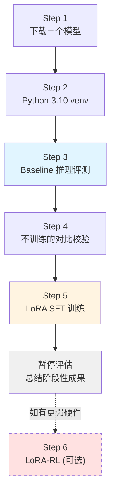

# CoLA-RL 本地复现尝试记录（14G 显存版）

> 创建日期：2026-05-04
> 硬件限制：1 × NVIDIA L20（14 GB 显存）
> 目标：在显存受限条件下，尽可能完整体验 "baseline 评测 → LoRA SFT"，为后续条件允许时的 LoRA-RL 打好基础
> 项目路径：`/data/workspace/Github-open/CoLA-RL`

---

## 目录

- [背景与约束](#背景与约束)
- [总体路线图](#总体路线图)
- [Step 1：下载三个模型](#step-1下载三个模型)
- [Step 2：创建 Python 3.10 虚拟环境](#step-2创建-python-310-虚拟环境)
- [Step 3：Baseline 评测脚本](#step-3baseline-评测脚本)
- [Step 4：不训练也能做的校验对比](#step-4不训练也能做的校验对比)
- [Step 5：LoRA SFT 训练](#step-5lora-sft-训练)
- [Step 6（暂缓）：LoRA-RL 尝试](#step-6暂缓lora-rl-尝试)
- [附录：关键参考](#附录关键参考)

---

## 背景与约束

### 硬件实况

| 项 | 值 |
| --- | --- |
| GPU | 1 × NVIDIA L20 |
| 显存 | 14 GB |
| CUDA | 12.2（driver） / 12.1（nvcc） |
| OS | Linux |
| 内存 | 185 GB |
| 磁盘可用 | 102 GB |

### 能做 vs 不能做

基于 `LLM后训练显存需求与硬件配置指南-2026-05-04.md` 的分析：

| 任务 | 14G 是否可行 |
| --- | --- |
| ✅ 纯推理（bf16，0.6B / 1.7B / 4B） | 可 |
| ✅ LoRA SFT（0.6B / 1.7B） | 可 |
| ✅ QLoRA SFT（4B） | 可 |
| ⚠️ 全参 SFT（0.6B） | 极限，容易 OOM |
| ⚠️ LoRA-RL（trl 框架，0.6B） | 可尝试，需精调 |
| ❌ 全参 GRPO（任意） | 不可行 |
| ❌ verl 框架下 RL | 默认假设 24G+ |

### 关键技术路线调整

- **放弃 verl**：原项目基于 verl 框架，默认假设 ≥24G/卡。14G 不做大改跑不起来
- **改走 trl + peft**：HuggingFace 官方库，对消费级 GPU 友好，原生支持 LoRA-SFT/DPO/GRPO
- **核心任务不变**：仍然是 CoLA 句子可接受性分类（GLUE 子任务），指标仍是 MCC

---

## 总体路线图



---

## Step 1：下载三个模型

### 1.1 目标模型清单

| 模型 | 参数量 | 权重大小 | 架构 | 状态 | 用途 |
| --- | --- | --- | --- | --- | --- |
| Qwen3-0.6B | 0.6B | ~1.5 GB | 标准 Qwen3（稠密） | ✅ 已下载 | LoRA SFT 主力 + baseline |
| Qwen3-1.7B | 1.7B | ~3.9 GB（分片） | 标准 Qwen3（稠密） | ✅ 已下载 | LoRA SFT 对比 + baseline |
| Qwen3.5-0.8B | 0.8B | ~1.7 GB | Qwen3.5 多模态混合注意力 | ✅ 已下载 | baseline 推理 + 尝试 LoRA |
| Qwen3.5-2B | 2B | ~4.3 GB | Qwen3.5 多模态混合注意力 | ✅ 已下载 | baseline 推理 + 尝试 QLoRA |

> 📌 **架构重要差异**：
> - **Qwen3 系列**（0.6B / 1.7B）：标准稠密 Transformer，`target_modules=["q_proj","k_proj","v_proj","o_proj"]`，`trl` / `peft` 开箱即用
> - **Qwen3.5 系列**（0.8B / 2B）：`Qwen3_5ForConditionalGeneration` 多模态架构，采用 **Gated DeltaNet（线性注意力）+ Gated Attention（标准注意力）混合结构**，带视觉编码器。LoRA target_modules 需要**手动探测**，`AutoModelForSequenceClassification` 可能不支持

### 1.2 下载操作（ModelScope，国内速度快）

```bash
cd /data/workspace/Github-open/CoLA-RL/model

# 确认 git-lfs 可用
git lfs install

# 后台下载（并发 3 个）
nohup git clone https://www.modelscope.cn/Qwen/Qwen3-0.6B.git    > /tmp/qwen3-0.6b.log 2>&1 &
nohup git clone https://www.modelscope.cn/Qwen/Qwen3-1.7B.git    > /tmp/qwen3-1.7b.log 2>&1 &
nohup git clone https://www.modelscope.cn/Qwen/Qwen3.5-2B.git    > /tmp/qwen3.5-2b.log 2>&1 &

# 等待完成（可用 ps + tail 日志监控）
```

### 1.3 完成后目录结构

```
CoLA-RL/model/
├── README.md
├── Qwen3-0.6B/                # 新下载 ~1.2G
├── Qwen3-1.7B/                # 新下载 ~3.4G
├── Qwen3.5-0.8B/              # 已有 ~1.7G
└── Qwen3.5-2B/                # 新下载 ~4.55G
# 合计约 10.9 GB，102 GB 可用空间充足
```

### 1.4 校验

```bash
du -sh /data/workspace/Github-open/CoLA-RL/model/*/
# 预期:
#   ~1.2G   Qwen3-0.6B/
#   ~3.4G   Qwen3-1.7B/
#   ~1.7G   Qwen3.5-0.8B/
#   ~4.55G  Qwen3.5-2B/
```

---

## Step 2：创建 Python 3.10 虚拟环境

### 2.1 为什么要 Python 3.10？

- Qwen3 系列的官方生态（`transformers`、`trl`）对 3.10+ 支持最好
- 避免污染全局环境和统一的 `browser-use-env`（那是 3.12，且已安装大量不相关包）
- 本项目独立环境，便于后续删除/重建

### 2.2 选择方案

本机现状：
- `/usr/bin/python3` → Python 3.9.16（太旧）
- `/data/workspace/efficiency/browser-use-env/venv/` → Python 3.12（版本OK，但不专用）

决定：**在 CoLA-RL 项目目录下建一个独立的 Python 3.10 venv**。

### 2.3 安装步骤

```bash
# 方式 A：如果系统没有 python3.10，用 install_binary 工具或 apt/conda 安装
# 方式 B：可以复用现有 3.12（transformers/trl/peft 都兼容），节省时间

# 推荐方式 B（先试）：
cd /data/workspace/Github-open/CoLA-RL
python3.12 -m venv .venv-cola
source .venv-cola/bin/activate
python --version  # 确认 3.12.x

# 如果 3.12 遇到兼容性问题再切 3.10
```

### 2.4 安装依赖

```bash
# 核心包（无 vllm / flash-attn，避免编译地狱）
pip install --upgrade pip
pip install \
    "torch>=2.3" \
    "transformers>=4.45" \
    "datasets>=3.0" \
    "peft>=0.13" \
    "accelerate>=1.0" \
    "trl>=0.12" \
    "bitsandbytes>=0.43" \
    "scikit-learn" \
    "pandas" \
    "pyarrow" \
    "tqdm" \
    "tensorboard" \
    "jupyter" \
    "ipykernel" \
    "matplotlib"

# 记录依赖
pip freeze > requirements-local.txt
```

### 2.5 快速验证

```python
# 新建 sanity_check.py
import torch
from transformers import AutoTokenizer, AutoModelForCausalLM

print(f"CUDA available: {torch.cuda.is_available()}")
print(f"GPU: {torch.cuda.get_device_name(0)}")
print(f"显存: {torch.cuda.get_device_properties(0).total_memory / 1e9:.1f} GB")

tok = AutoTokenizer.from_pretrained("model/Qwen3-0.6B")
mdl = AutoModelForCausalLM.from_pretrained("model/Qwen3-0.6B", torch_dtype=torch.bfloat16, device_map="cuda")
print(f"模型加载成功，权重占用: {mdl.get_memory_footprint() / 1e9:.2f} GB")
```

### 2.6 记录环境

按照项目 memory rule，把搭建过程和踩坑点补充到 `my_try/docs/environment.md`。

---

## Step 3：Baseline 评测脚本

### 3.1 目标

在**完全不训练**的情况下，用三个模型直接对 CoLA 验证集（`in_domain_dev.tsv`，527 条）做零样本推理，得到 MCC baseline。

### 3.2 评测设计

**Prompt**（沿用原项目设计）：

```
Decide whether the following sentence is grammatically acceptable or not.
If it is grammatically correct, answer "acceptable". If not, answer "unacceptable".
Only output "acceptable" or "unacceptable", and do not output any other information.

Sentence: {sentence}

Your answer:
```

**指标**：Matthews Correlation Coefficient (MCC)

**对比维度**：

| 维度 | 选项 |
| --- | --- |
| 模型 | Qwen3-0.6B / Qwen3-1.7B / Qwen3.5-0.8B |
| 生成模式 | Greedy / Sampling(t=0.6) |
| 是否启用 thinking | enable_thinking=False（快速） / True（慢但可能更准） |

### 3.3 脚本设计

新建：`/data/workspace/Github-open/CoLA-RL/my_try/scripts/eval_baseline.py`

```python
"""
Baseline 零样本评测脚本
对比三个模型在 CoLA 验证集上的 MCC
"""
import argparse
import json
import time
from pathlib import Path

import pandas as pd
import torch
from sklearn.metrics import matthews_corrcoef, confusion_matrix
from transformers import AutoTokenizer, AutoModelForCausalLM
from tqdm import tqdm

PROMPT_TEMPLATE = """Decide whether the following sentence is grammatically acceptable or not. If it is grammatically correct, answer "acceptable". If not, answer "unacceptable". Only output "acceptable" or "unacceptable", and do not output any other information.

Sentence: {sentence}

Your answer:"""


def parse_answer(text: str) -> str | None:
    """从模型输出中抽取 acceptable/unacceptable 标签"""
    text = text.lower().strip()
    # 去除 <think>...</think> 包裹
    if "</think>" in text:
        text = text.split("</think>")[-1].strip()
    if "unacceptable" in text:
        return "unacceptable"
    if "acceptable" in text:
        return "acceptable"
    return None


def evaluate(model_path: str, data_path: str, enable_thinking: bool, max_new_tokens: int):
    print(f"\n{'='*60}")
    print(f"Model: {model_path}")
    print(f"Thinking: {enable_thinking}")
    print(f"{'='*60}")

    tok = AutoTokenizer.from_pretrained(model_path)
    mdl = AutoModelForCausalLM.from_pretrained(
        model_path, torch_dtype=torch.bfloat16, device_map="cuda"
    )
    mdl.eval()

    df = pd.read_csv(
        data_path, sep="\t", header=None,
        names=["source", "label", "first_label", "text"],
    )
    print(f"验证集大小: {len(df)}")

    y_true, y_pred, parse_fail = [], [], 0
    start = time.time()

    for row in tqdm(df.itertuples(index=False), total=len(df)):
        prompt = PROMPT_TEMPLATE.format(sentence=row.text)
        messages = [{"role": "user", "content": prompt}]
        try:
            inputs = tok.apply_chat_template(
                messages, add_generation_prompt=True,
                enable_thinking=enable_thinking, return_tensors="pt"
            ).to("cuda")
        except TypeError:
            # 某些模型不支持 enable_thinking 参数
            inputs = tok.apply_chat_template(
                messages, add_generation_prompt=True, return_tensors="pt"
            ).to("cuda")

        with torch.no_grad():
            out = mdl.generate(
                inputs, max_new_tokens=max_new_tokens,
                do_sample=False, pad_token_id=tok.eos_token_id,
            )
        resp = tok.decode(out[0][inputs.shape[-1]:], skip_special_tokens=True)
        pred = parse_answer(resp)

        true_label = "acceptable" if row.label == 1 else "unacceptable"
        y_true.append(true_label)
        if pred is None:
            parse_fail += 1
            # 解析失败按错误方向归类
            y_pred.append("unacceptable" if true_label == "acceptable" else "acceptable")
        else:
            y_pred.append(pred)

    elapsed = time.time() - start
    mcc = matthews_corrcoef(y_true, y_pred)
    cm = confusion_matrix(
        y_true, y_pred, labels=["unacceptable", "acceptable"]
    )

    result = {
        "model": model_path,
        "enable_thinking": enable_thinking,
        "mcc": float(mcc),
        "parse_fail": parse_fail,
        "confusion_matrix": cm.tolist(),
        "elapsed_sec": round(elapsed, 1),
        "samples": len(df),
    }

    print(f"\nMCC: {mcc:.4f}")
    print(f"解析失败: {parse_fail}/{len(df)}")
    print(f"混淆矩阵:\n{cm}")
    print(f"耗时: {elapsed:.1f}s")

    del mdl
    torch.cuda.empty_cache()
    return result


if __name__ == "__main__":
    parser = argparse.ArgumentParser()
    parser.add_argument("--data", default="cola_data/in_domain_dev.tsv")
    parser.add_argument("--out", default="my_try/results/step3_baseline/baseline_results.json")
    parser.add_argument("--models", nargs="+", default=[
        "model/Qwen3-0.6B",
        "model/Qwen3-1.7B",
        "model/Qwen3.5-0.8B",
        "model/Qwen3.5-2B",
    ])
    parser.add_argument("--thinking", action="store_true", help="enable thinking mode")
    parser.add_argument("--max_new_tokens", type=int, default=32)
    args = parser.parse_args()

    results = []
    for m in args.models:
        if not Path(m).exists():
            print(f"[skip] {m} 不存在")
            continue
        try:
            results.append(evaluate(m, args.data, args.thinking, args.max_new_tokens))
        except Exception as e:
            print(f"[error] {m}: {e}")
            results.append({"model": m, "error": str(e)})

    Path(args.out).parent.mkdir(parents=True, exist_ok=True)
    with open(args.out, "w") as f:
        json.dump(results, f, indent=2, ensure_ascii=False)
    print(f"\n结果已保存: {args.out}")
```

### 3.4 运行计划

```bash
cd /data/workspace/Github-open/CoLA-RL
source .venv-cola/bin/activate

# 快速版（非思考模式，预期每个模型 10-20 分钟）
python my_try/scripts/eval_baseline.py --max_new_tokens 32

# 思考模式（慢 5-10 倍，约每模型 1-2 小时）
python my_try/scripts/eval_baseline.py --thinking --max_new_tokens 1024
```

**预期结果**（参考原项目 README）：

| 模型 | Qwen3 官方报告 MCC |
| --- | --- |
| Qwen3-0.6B | 0.223 |
| Qwen3-1.7B | 未报告，推测 0.3-0.4 |
| Qwen3.5-0.8B | 未知，预期比 0.6B 高（同代新架构） |
| Qwen3.5-2B | 未知，预期四者最高（规模最大 + 新架构） |

### 3.5 输出物

- `my_try/results/step3_baseline/baseline_results.json`：JSON 格式的所有模型结果
- 日志：标准输出 + MCC 分数

---

## Step 4：不训练也能做的校验对比

在不动权重的前提下，还可以做以下几个有价值的对比，建立对任务/模型/数据的深入理解。

### 4.1 思考模式 vs 非思考模式对比

Qwen3 原生支持 `enable_thinking=True/False`。对比二者：

- 非思考模式：直接输出 acceptable/unacceptable
- 思考模式：先 `<think>...</think>` 推理，再输出答案

**假设**：CoLA 任务是二分类，思考模式是否真的有帮助？

```bash
python my_try/scripts/eval_baseline.py --models model/Qwen3-0.6B                   # thinking=False
python my_try/scripts/eval_baseline.py --models model/Qwen3-0.6B --thinking        # thinking=True
```

### 4.2 Prompt 敏感性测试

模型在不同 prompt 下表现差异有多大？设计 3-5 个 prompt 变体：

| 变体 | 描述 |
| --- | --- |
| P0（原版） | 项目提供的 prompt |
| P1（更明确） | 加 few-shot 示例（2 个 accept + 2 个 reject） |
| P2（简化） | 去掉所有指令约束，只问 "Is this sentence grammatical?" |
| P3（CoT 引导） | "Let's think step by step before answering." |
| P4（反向） | 先问 "Is this ungrammatical?"，观察是否对称 |

新建：`my_try/eval_prompts.py`

**产出**：不同 prompt 下各模型 MCC 的对比表，说明"prompt engineering 的上限"，作为判断 SFT 必要性的依据。

### 4.3 Few-shot 增益曲线

从 0-shot、1-shot、2-shot、5-shot、8-shot 逐步增加 in-context 示例：

- 看 few-shot 在什么数量级开始收益递减
- 对比 "8-shot few-shot" vs "LoRA SFT" 的 ceiling

这对后续 SFT 的意义很大：**如果 8-shot 就能接近 SFT 效果，SFT 可能没必要**。

### 4.4 分词和长度分析

```python
# my_try/analyze_data.py
# 统计：
# 1. 验证集句子长度分布（token 数）
# 2. acceptable / unacceptable 比例是否平衡
# 3. 最长 / 最短样本
# 4. 不同 source 的分布
```

### 4.5 错误样本分析

拿 baseline 结果做 error analysis：

- **False Positive**（模型说 acceptable 但实际 unacceptable）：模型漏判的语法问题
- **False Negative**（模型说 unacceptable 但实际 acceptable）：模型误判的冤案

挑出 20 条 FP + 20 条 FN，人工/Claude 分析，**看是什么类型的语法错误模型学不会**。这是决定 SFT 数据增强方向的关键依据。

### 4.6 对比 Step 4 的产出

| 输出 | 文件 |
| --- | --- |
| 思考模式对比表 | `my_try/results_thinking_compare.md` |
| Prompt 敏感性表 | `my_try/results_prompt_sensitivity.md` |
| Few-shot 曲线 | `my_try/results_fewshot_curve.png` |
| 数据分析报告 | `my_try/results_data_analysis.md` |
| 错误样本分析 | `my_try/results_error_analysis.md` |

---

## Step 5：LoRA SFT 训练

### 5.1 目标

用 LoRA 微调 Qwen3-0.6B 和 Qwen3-1.7B，在 CoLA 训练集上训练，验证集上评测，与 baseline 对比提升。

### 5.2 训练数据设计

CoLA 训练集：`cola_data/in_domain_train.tsv`，**8551 条**，格式：

```
source \t label \t first_label \t text
```

**两种数据格式方案**：

#### 方案 A：直接分类（无 CoT）

```json
{
  "instruction": "<原 prompt>",
  "output": "acceptable"   // 或 "unacceptable"
}
```

- 优点：简单、训练快、数据易得
- 缺点：模型不思考，可能效果天花板低

#### 方案 B：带 CoT（需要 R1 蒸馏数据）

```json
{
  "instruction": "<原 prompt>",
  "output": "<think>{reasoning}</think>\n\n{answer}"
}
```

- 优点：有 CoT，效果上限更高
- 缺点：需要先用 DeepSeek R1/V3 蒸馏训练集，**成本** ≈ 8551 次 API 调用

**先做方案 A**，验证流程通。如果效果不满意，再评估要不要花钱蒸馏 R1 数据做方案 B。

### 5.3 数据准备脚本

新建：`my_try/scripts/prepare_sft_data.py`

```python
"""将 CoLA 训练集转为 trl.SFTTrainer 所需格式"""
import json
from pathlib import Path
import pandas as pd

PROMPT_TEMPLATE = """..."""  # 同 baseline

def main():
    df = pd.read_csv(
        "cola_data/in_domain_train.tsv", sep="\t", header=None,
        names=["source", "label", "first_label", "text"],
    )
    samples = []
    for row in df.itertuples(index=False):
        answer = "acceptable" if row.label == 1 else "unacceptable"
        samples.append({
            "messages": [
                {"role": "user", "content": PROMPT_TEMPLATE.format(sentence=row.text)},
                {"role": "assistant", "content": answer},
            ]
        })
    Path("my_try/data").mkdir(parents=True, exist_ok=True)
    with open("my_try/data/sft_train.jsonl", "w") as f:
        for s in samples:
            f.write(json.dumps(s, ensure_ascii=False) + "\n")
    print(f"保存 {len(samples)} 条到 my_try/data/sft_train.jsonl")

if __name__ == "__main__":
    main()
```

### 5.4 LoRA SFT 训练脚本

新建：`my_try/scripts/train_lora_sft.py`

```python
"""
LoRA SFT on Qwen3 for CoLA
基于 trl.SFTTrainer + peft.LoraConfig
预期显存占用 (Qwen3-0.6B, bsz=8, seqlen=256): ~3 GB
"""
import argparse
from datasets import load_dataset
from transformers import AutoTokenizer, AutoModelForCausalLM
from peft import LoraConfig, get_peft_model
from trl import SFTTrainer, SFTConfig
import torch

def main():
    parser = argparse.ArgumentParser()
    parser.add_argument("--model", default="model/Qwen3-0.6B")
    parser.add_argument("--output", default="my_try/ckpt/Qwen3-0.6B-lora")
    parser.add_argument("--lora_rank", type=int, default=16)
    parser.add_argument("--lora_alpha", type=int, default=32)
    parser.add_argument("--epochs", type=int, default=3)
    parser.add_argument("--bsz", type=int, default=8)
    parser.add_argument("--grad_accum", type=int, default=4)
    parser.add_argument("--lr", type=float, default=2e-4)
    parser.add_argument("--max_len", type=int, default=256)
    args = parser.parse_args()

    tok = AutoTokenizer.from_pretrained(args.model)
    model = AutoModelForCausalLM.from_pretrained(
        args.model, torch_dtype=torch.bfloat16, device_map="cuda"
    )

    lora_cfg = LoraConfig(
        r=args.lora_rank,
        lora_alpha=args.lora_alpha,
        target_modules=["q_proj", "k_proj", "v_proj", "o_proj"],
        lora_dropout=0.05,
        bias="none",
        task_type="CAUSAL_LM",
    )
    model = get_peft_model(model, lora_cfg)
    model.print_trainable_parameters()

    ds = load_dataset("json", data_files="my_try/data/sft_train.jsonl", split="train")

    cfg = SFTConfig(
        output_dir=args.output,
        num_train_epochs=args.epochs,
        per_device_train_batch_size=args.bsz,
        gradient_accumulation_steps=args.grad_accum,
        learning_rate=args.lr,
        warmup_ratio=0.03,
        lr_scheduler_type="cosine",
        bf16=True,
        logging_steps=10,
        save_strategy="epoch",
        report_to="tensorboard",
        max_seq_length=args.max_len,
        gradient_checkpointing=True,
    )

    trainer = SFTTrainer(model=model, args=cfg, train_dataset=ds, tokenizer=tok)
    trainer.train()
    trainer.save_model(args.output)
    print(f"Done. Saved to {args.output}")

if __name__ == "__main__":
    main()
```

### 5.5 实验矩阵

> 📌 **根据 Step 4 的结论调整实验计划**（见 `my_try/docs/step4_summary.md §7`）：
> 1. **主攻 Qwen3-0.6B**（baseline=0.000，提升空间最大）
> 2. **1.7B 做对照**（baseline=0.500，看 LoRA 能否再往上推）
> 3. **Qwen3.5-0.8B 下掉**（架构非标 + baseline 不如 1.7B，性价比低）
> 4. **Qwen3.5-2B 只做 1 个 QLoRA 对照实验**（baseline 最强 0.549，看 LoRA 上限）
> 5. **CoT 数据实验下掉**（Step 4 证明 CoT 让 Qwen3 解析失败率飙升，不值得）

| 实验 ID | 模型 | 方法 | LoRA rank | Epoch | 预计显存 | 预计耗时 | 目标 MCC |
| --- | --- | --- | --- | --- | --- | --- | --- |
| E1 | Qwen3-0.6B | LoRA | 16 | 3 | ~3 GB | ~30 min | ≥ 0.30 |
| E2 | Qwen3-0.6B | LoRA | 32 | 3 | ~3 GB | ~30 min | ≥ 0.40 |
| E3 | Qwen3-0.6B | LoRA | 64 | 3 | ~3.5 GB | ~35 min | ≥ 0.40 |
| E4 | Qwen3-1.7B | LoRA | 16 | 3 | ~5 GB | ~1 h | ≥ 0.58 |
| E5 | Qwen3-1.7B | LoRA | 32 | 3 | ~5.5 GB | ~1 h | ≥ 0.60 |
| E6（可选） | Qwen3.5-2B | QLoRA (4bit) | 16 | 3 | ~4-5 GB | ~1 h | ≥ 0.58 |

> **目标 MCC 的设定依据**：
> - 0.6B：从 0.000 拉到 0.30+ 即为"学会任务"（超越自身 thinking=0.254），0.40 = 匹敌经典 LR × 2
> - 1.7B：从 0.500 拉到 0.58+ 才能盖过 Qwen3.5-2B 的 baseline（0.549），0.60 = 接近原项目全参 SFT 报告的 0.657
> - 2B：从 0.549 拉到 0.58+（LoRA 对强 baseline 的增益通常 +0.03~0.08）

> ⚠️ **Qwen3.5-2B 特别提示（若做 E6）**：
> - 需先用 `print(model)` 探测 LoRA `target_modules` 名称（Gated DeltaNet / Gated Attention 的投影层命名不同于标准 Qwen3）
> - 标准 bf16 LoRA SFT 需 ~8 GB 显存，14 G 卡边缘；**走 QLoRA（4bit 基座 + LoRA）** 稳妥
> - `bitsandbytes` 已在 Step 2 安装好

### 5.6 评测训练后的 LoRA

```python
# my_try/scripts/eval_lora.py
# 用 peft.PeftModel.from_pretrained 加载 LoRA adapter
# 在 CoLA 验证集上评测 MCC，复用 eval_baseline 的评测逻辑
```

### 5.7 对比与分析

产出表格：`my_try/results_lora_sft.md`

| 实验 | Baseline MCC | LoRA SFT 后 MCC | 增益 |
| --- | --- | --- | --- |
| Qwen3-0.6B | 0.22（预期） | ? | ? |
| Qwen3-1.7B | ?（待测） | ? | ? |
| Qwen3.5-0.8B | ?（待测） | ? | ? |
| Qwen3.5-2B | ?（待测） | ? | ? |

讨论：
- 不同 rank 的影响
- 不同模型规模的提升幅度（0.6B / 0.8B / 1.7B / 2B 阶梯）
- Qwen3 vs Qwen3.5 新架构的效果对比
- 标准 LoRA vs QLoRA 对 MCC 是否有明显损失
- 是否出现 LoRA 容量瓶颈
- 和原项目全参 SFT 报告的 0.598 / 0.657 对比

---

## Step 6（暂缓）：LoRA-RL 尝试

**前置条件**：Step 5 完成，且满足以下之一：
- 显存充裕（换到 ≥24G 的机器）
- 或愿意接受极简 LoRA-GRPO（非 vLLM、n=4、短序列）的有限复现

### 6.1 技术选型

- **框架**：trl（HuggingFace 官方），而非 verl
- **基础模型**：LoRA SFT 后的 checkpoint（E1 或 E4）
- **算法**：GRPO（走 `trl.GRPOTrainer`）
- **奖励**：规则函数，同原项目 `cola.py`（==比较 + ±1 分）

### 6.2 显存预估（Qwen3-0.6B + LoRA-GRPO）

| 组件 | 显存 |
| --- | --- |
| 基座（冻结，bf16） | 1.2 GB |
| LoRA 参数 + Adam | <0.2 GB |
| Ref（复用基座，零额外） | 0 |
| 生成（`model.generate`，无 vLLM） | 1-2 GB |
| 激活（n=4, seq=512, bsz=1） | ~3-4 GB |
| 杂项 | ~1 GB |
| **合计** | **~7-9 GB** |

14G 卡**理论可行**，需要小心：
- `rollout.n` 降到 4
- `max_new_tokens` 降到 512
- 批次最小化
- 不用 vLLM（避免独占显存）

### 6.3 待验证点

- trl 最新版是否支持纯 PyTorch（非 vLLM）的 GRPO rollout
- 14G 能否在"合理时间"内跑完 1 epoch（预期 8-15h）
- LoRA-RL 相比 LoRA SFT 是否带来提升（而非反噬）

**以上三点任一失败，即放弃 Step 6，等未来硬件条件满足再恢复**。

---

## 附录：关键参考

### 项目结构（当前实况）

```
CoLA-RL/
├── .gitignore                  # ★ 忽略 .venv-cola/ 和 model/Qwen*/
├── cola_data/                  # 原始数据（已有，未动）
├── data/                       # 原项目生成的 parquet（可选，本次不用）
├── docs/                       # 原项目文档
├── model/                      # (.gitignore 已忽略)
│   ├── Qwen3-0.6B/             # Step 1 下
│   ├── Qwen3-1.7B/             # Step 1 下
│   ├── Qwen3.5-0.8B/           # 已有
│   └── Qwen3.5-2B/             # Step 1 下
├── recipe/                     # 原 verl recipe（本次不用，未动）
├── scripts/                    # 原项目脚本（本次不用，未动）
├── verl/                       # 原 verl 代码（本次不用，未动）
├── my_try/                     # ★ 本次所有产出都放这里
│   ├── README.md               # 入口导航
│   ├── my_try.md               # ★ 本文档（总计划）
│   ├── environment.md          # 环境搭建记录
│   ├── requirements-local.in   # 源依赖清单
│   ├── requirements-local.txt  # pip freeze 产出
│   ├── sanity_check.py         # 环境验证脚本
│   ├── eval_baseline.py        # LLM 评测脚本（plain/fewshot/cot/thinking）
│   ├── eval_classical.py       # 经典 ML baseline
│   ├── baseline_summary.md     # Step 3 汇总
│   ├── step4_summary.md        # Step 4 汇总
│   ├── baseline_results.json   # Step 3 结果
│   ├── baseline_classical.json # 经典 ML 结果
│   ├── res_*.json × 12         # Step 4 细节
│   │
│   ├── prepare_sft_data.py     # (Step 5 待建)
│   ├── train_lora_sft.py       # (Step 5 待建)
│   ├── eval_lora.py            # (Step 5 待建)
│   ├── data/                   # (Step 5 待建)
│   │   └── sft_train.jsonl
│   ├── ckpt/                   # (Step 5 待建, .gitignore 已忽略)
│   │   ├── Qwen3-0.6B-lora/
│   │   ├── Qwen3-1.7B-lora/
│   │   └── Qwen3.5-2B-qlora/
│   └── results_lora_sft.md     # (Step 5 待建)
│
├── .venv-cola/                 # 本次专用虚拟环境 (.gitignore 已忽略)
├── README.md / LICENSE / ...   # 原项目 8 个文件（未动）
```

> 📌 **重要约定**：本次所有产出都在 `my_try/` 下，项目根目录保持原仓库的干净状态。
> 脚本执行时**从项目根目录调用**（`cd CoLA-RL && python my_try/xxx.py`），因为脚本内使用 `cola_data/`、`model/` 等项目根相对路径。

### 时间估算（全流程）

| 阶段 | 预计耗时 |
| --- | --- |
| Step 1 下载 | 10-30 min（取决于网速） |
| Step 2 环境 | 20-40 min |
| Step 3 Baseline 评测 | 每模型 10-20 min（不含 thinking），×3 |
| Step 4 对比校验 | 2-4 h |
| Step 5 LoRA SFT | 每实验 0.5-1 h，共 ~4-6 h |
| **Step 1-5 总计** | **~1-2 个工作日** |
| Step 6（若做） | +1-2 工作日 |

### 关联文档

- `docs/verl框架训练与Debug.md`：原项目作者的详细教程（供参考）
- `work_notes/2-知识库/LLM后训练显存需求与硬件配置指南-2026-05-04.md`：显存估算原理
- `README.md`：原项目说明
- `prepare_rl_data.ipynb` / `prepare_sft_data.ipynb`：原项目数据准备（本次可忽略或仅供参考）

### 预期成果

完成 Step 1-5 后，你会拥有：

1. ✅ 本地跑通过的完整 LLM 后训练工作流（非 verl，更普适）
2. ✅ 三个模型在 CoLA 任务上的 baseline + SFT 后性能对比
3. ✅ 对"什么时候该 SFT、什么时候 prompt 工程就够"的一手判断
4. ✅ 可复用的 LoRA adapter（几百 MB，可部署）
5. ✅ 下次有多卡机器时，直接走 Step 6 或切回 verl 的完整心智模型

---

## 执行节奏建议

1. **先 review 本文档**，确认流程和重点无误后再开工
2. **分步执行**，每步完成后更新本文档的状态（✅/⬜）
3. **遇到坑随时记录**到 `my_try/docs/environment.md`
4. **每个 Step 结束产出一份简短 `results_*.md`**，沉淀过程

---

**状态追踪**：

- [x] Step 1：下载四个模型 ✅ 2026-05-04 完成，合计 ~12 GB
- [x] Step 2：创建虚拟环境 + 装依赖 ✅ 2026-05-04 完成（Python 3.12.12 / torch 2.5.1+cu121 / transformers 5.7.0 / trl 1.3.0，详见 `docs/environment.md`；sanity check 通过，Qwen3-0.6B bf16 占 1.19 GB）
- [x] Step 3：Baseline 评测 ✅ 2026-05-04 完成（零样本非思考，527 样本，合计 6 min；MCC：0.6B=**0.000**、1.7B=**0.500**、3.5-0.8B=**0.340**、3.5-2B=**0.549**；详见 `my_try/docs/baseline_summary.md`）
- [x] Step 4：不训练对比校验 ✅ 2026-05-04 完成（4 本地模型 × 4 变体 plain/fewshot/cot/thinking + 5 经典 ML baseline + **4 个 API 大模型** zero-shot；**关键结论**：prompt 工程无正收益，API 模型天花板 0.727 (deepseek-v3-0324)，**推理型模型 hy3-preview 反而最差 0.527**；详见 `my_try/docs/step4_summary.md`）
- [x] Step 5：LoRA SFT ✅ 2026-05-04 完成（**E1: Qwen3-0.6B + LoRA r=16 → MCC 0.000→0.5406**，**E4: Qwen3-1.7B + LoRA r=16 → MCC 0.500→0.6246**；**额外补做 E1-FULL v2 全参 SFT**：Qwen3-0.6B 0.000→0.5361，显存峰值 13.2 GB 首次充分用满 14G 卡；LoRA 与全参几乎打平 (0.541 vs 0.536)，LoRA 综合性价比更高；详见 `my_try/docs/step5_summary.md`）
- [ ] Step 6：LoRA-RL（🔄 运行中 @ 2026-05-05 00:45，E1-GRPO: 从 E1 SFT adapter 起点，trl GRPOTrainer + 纯 PyTorch rollout，num_gen=4 / temp=1.2 / beta=0 Dr.GRPO 风格，预计 65 min 跑完 8551 样本 1 epoch；显存仅占 2 GB）
